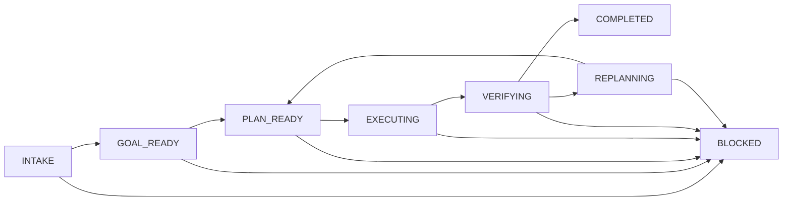
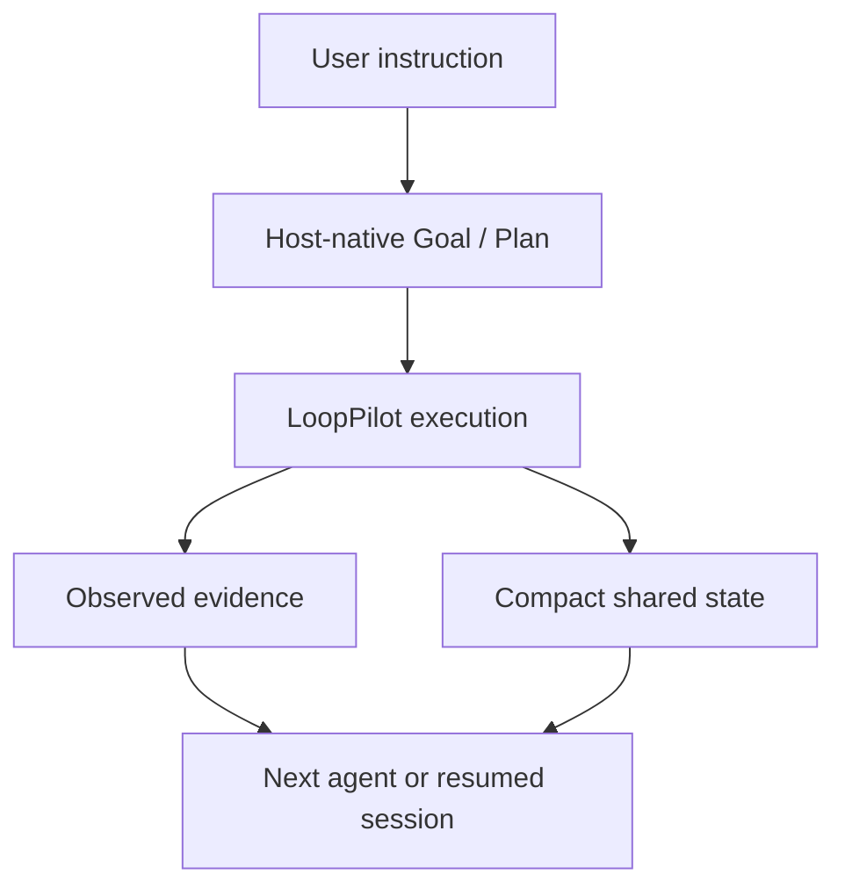

# LoopPilot

LoopPilot is a proactive, host-native execution strategy for carrying complex work
toward evidence-backed completion without granting unlimited autonomy.

## What It Is

LoopPilot is a behavioral specification for an AI agent that already has some
combination of context, planning, tools, and task state. It tells that agent to:

1. clarify the real Goal and success criteria;
2. reuse the native Plan instead of creating a second planner;
3. choose and execute the highest-value safe action;
4. verify the real result;
5. adapt only when evidence changes the best path; and
6. stop with an accurate outcome and remaining gaps.

The initial repository is Markdown only. It does not provide an independent runtime,
agent framework, scheduler, memory service, CLI, backend, or fixed integration API.

## Why It Is Not a Retry Prompt

A retry prompt usually repeats an operation until a count or timeout. LoopPilot
requires every iteration to produce measurable progress, new evidence, a new blocker,
or a justified Plan change. An unchanged failed action cannot be repeated merely to
keep the loop running.

LoopPilot also distinguishes a recoverable failure from a missing prerequisite,
unavailable verification, and diminishing returns. It may change strategy or stop;
persistence is not mechanical repetition.

## Why It Does Not Replace the Host Planner

LoopPilot treats the host's Goal, Plan, Todo, Memory, tools, and task status as the
source of truth when they exist. It updates that state instead of maintaining a
parallel Plan. A host with no planning feature may use a minimal task-local Plan, but
LoopPilot does not define a universal planner or assume private Goal and Plan APIs.

See [host capability levels](docs/host-capabilities.md) for prompt-only, planning and
tool, and persistent hosts.

## One Useful Iteration

The following pseudocode expresses the concept:

```text
while useful_safe_work_remains:
    inspect_goal_and_native_plan()
    action = select_next_unblocked_action()
    result = execute(action)
    evidence = verify(result)
    update_native_plan(result, evidence)
```

These names are illustrative. They are not functions a host must implement. The
actual host may represent the same behavior with conversation context, a task list,
tool calls, or persistent state.

A useful iteration changes the task state through progress, evidence, a blocker, or
an evidence-backed Plan change. Reflection or status narration without one of those
results does not justify another iteration.

## When It Activates

Strong activation signals include:

- multiple dependent steps;
- tools, file changes, external actions, or several deliverables;
- tests, source checks, file inspection, or other real verification;
- a likely need to recover from an initial failure;
- gradual progress toward explicit acceptance criteria; or
- an explicit LoopPilot invocation.

LoopPilot should not implicitly activate for a factual answer, one-sentence rewrite,
casual conversation, brainstorming-only request, or advice-only request. Explicit
invocation still applies its safety and honesty rules, but does not justify an
unnecessary multi-stage Plan.

## Lifecycle and Outcomes

The lifecycle is a conceptual vocabulary, not a required state machine.



A run reports one primary outcome:

- **Completed:** the full Goal is satisfied and verified.
- **Partially Completed:** valuable work exists, but known gaps remain.
- **Blocked:** a missing prerequisite prevents the next useful action.
- **Budget Stop:** a resource limit or diminishing return ends the run.

Partially Completed and Budget Stop are report classifications; a host does not need
to add them as persisted lifecycle states. See [the lifecycle model](docs/lifecycle.md)
and [safety and stopping](docs/safety-and-stopping.md).

## Minimal Use

```text
Use LoopPilot to update the project configuration, verify the build, and continue
until the acceptance criteria pass or a meaningful stop condition is reached.
```

Expected behavior:

```text
Goal: update configuration without breaking the build.
Native Plan: inspect -> edit -> build -> inspect diff.
Evidence: actual file contents, command status, and relevant checks.
Stop: Completed, Partially Completed, Blocked, or Budget Stop with remaining gaps.
```

## Shared State and Multi-Agent Handoff

[`AGENTS.md`](AGENTS.md) gives Agents and hosts that load it the same stable
instruction priority, verification discipline, safety rules, and authority
boundaries. Dynamic task state is kept separate under the optional
[`.looppilot/` protocol](.looppilot/README.md), so old task details do not turn into
permanent repository rules.

The host-native Goal, Plan, Todo, task state, or memory remains authoritative.
Shared files contain only the minimum facts, evidence, blockers, decisions, and
next-action summary needed for another Agent or resumed session. They do not store a
second complete Plan, complete conversations, tool-call logs, credentials, or
private chain-of-thought.



When unfinished complex work needs durable continuity, the Agent MAY update
`.looppilot/STATE.md` and `.looppilot/HANDOFF.md` after a material event. The
receiving Agent MUST re-check the current user instruction, working tree, native
Plan, and tool state. The handoff transfers context, not authority. Simple one-step
tasks SHOULD skip shared-state updates entirely.

See [`AGENTS.md`](AGENTS.md) for repository-wide rules,
[`.looppilot/README.md`](.looppilot/README.md) for the protocol, and
[`SKILL.md`](SKILL.md) for LoopPilot's execution behavior.

## Supervised Multi-Agent Delegation

LoopPilot can describe supervised delegation when the host already supports
multiple Agents, delegated sessions, or equivalent task assignment. It does not
automatically create Agents or provide a scheduler, concurrency runtime, file
isolation, locking, cancellation service, or merge engine.

One Supervisor remains accountable for the parent Goal. Workers handle only
contracted subtasks, an independent Reviewer checks scope and evidence, and one
Supervisor or Integrator owns the final combined result. `approved` means a subtask
passed review; it is not `integrated` until the reviewed work is combined and
parent-level checks pass.

Simple tasks are completed directly rather than split for ceremony. Parallel work
requires non-overlapping scope or suggestion-only tasks followed by one Integrator
edit. Delegation never transfers authority beyond the explicit Task Contract and
latest user instruction.

See the [coordination design](docs/multi-agent-coordination.md), inactive
[delegation summary](.looppilot/DELEGATION.md), and
[Task Contract protocol](.looppilot/tasks/README.md). Real multi-Agent creation,
Reviewer independence, concurrency isolation, and named-host behavior remain
unverified.

For complex delegated work, the Supervisor first decides whether current external
facts are necessary. It prepares a traceable
[Research Brief](.looppilot/RESEARCH-TEMPLATE.md) only when local evidence is not
sufficient, and selects only Skills the host has actually confirmed are available.
The minimum relevant Skill set and fallback are recorded in the Task Contract;
assignment never expands authority or installs anything.

Submitted tasks pass through separate Standards and Spec reviews. Both must pass
and required evidence must be observed before `approved`. The parent
[Checklist](.looppilot/CHECKLIST.md) remains unchecked until the Integrator combines
the work and verifies the parent result. It stores stable deliverables, concise
evidence, context pressure, and one Resume Point rather than duplicating the native
Plan.

Context pressure is classified as `unknown`, `normal`, `elevated`, `high`, or
`critical`. High or critical pressure triggers state persistence and a controlled
budget stop before forced interruption; no exact token balance is assumed. Real
network research, installed-Skill discovery, token signals, independent Reviewers,
and budget-stop recovery remain host capabilities and are not verified by this
repository's static tests.

## Loop Engineering Foundation

LoopPilot now defines the first-stage architecture for a Project made of bounded
Loops. A Loop is a cohesive change set that can be independently implemented,
integrated, reviewed, accepted, committed when authorized, and resumed from
persisted state. The model connects Tasks, Worker Deliveries, Integration Records,
Review Reports, Findings, three-layer acceptance, Loop Closure, and Checkpoints.

The existing shared-state protocol remains
[Lightweight Mode](docs/protocol-modes-and-state-sources.md). Full Loop Mode is a
documented migration target for multi-Loop, high-risk, or cross-context delivery;
it is not an implemented runtime or a claim of host compatibility.

Start with the [Loop Engineering model](docs/loop-engineering-model.md), the
[Project Engineering Context](docs/project-engineering-context.md),
[pattern-selection rules](docs/architecture-pattern-selection.md), the
[Project Closure target](docs/project-closure.md), and the
[Full Loop migration plan](docs/full-loop-migration-plan.md).

### Full Loop Contracts and Ledgers

Phase 2 adds inactive [Full Loop templates](.looppilot/full-loop/README.md) for a
Project Loop Map, Loop Contract, Task Ledger, and Finding Ledger. The Loop Map owns
Loop status; the two Ledgers own Task and Finding status. Detailed artifacts and
Checklists remain projections or evidence, and only a `closed` Loop may be checked.

Lightweight Mode remains unchanged for small work. These templates and validators
are static protocol structure, not a workflow runtime or evidence of real-host
behavior. See [Full Loop contracts and Ledgers](docs/full-loop-contracts-and-ledgers.md).

### Full Loop Delivery, Review, and Closure

Phase 3 adds six inactive templates for Worker Delivery, Integration Record, Review
Report, Finding Detail, Rework Task, and Loop Closure. Task-level Readiness gates a
Delivery into integration; Loop-level Spec and Standards reviews judge the unified
outcome. Findings enter the Finding Ledger before scoped rework, Reviewer
reverification precedes closure, and Loop Closure projects `closed` only through
the Loop Map after all acceptance layers and Barriers pass.

This remains a static protocol: it does not schedule Agents, mutate Ledgers,
integrate Git work, infer severity, create commits, or recover a Checkpoint. See the
[Phase 3 delivery protocol](docs/full-loop-delivery-review-and-closure.md).

### Full Loop Checkpoint and Context Recovery

Phase 4 adds three inactive templates: Checkpoint, Context Compaction Manifest, and
Resume Validation Report. `CHECKPOINT.md` is the only recovery authority; it records
a verified repository boundary, unfinished work, current permissions, evidence to
revalidate, and one exact Resume Point. The Manifest selects minimal context, and
the Resume Report compares the record with current instructions, Git, Ledgers,
artifacts, tools, Skills, and authority before continuation.

At high context pressure the Supervisor stabilizes the smallest safe verifiable
unit and prepares recovery state. At critical pressure new work stops after state
is persisted. These static contracts do not count tokens, compact context, create
Checkpoints, start sessions, transfer Agents, reset Git, or execute recovery. See
the [Phase 4 recovery protocol](docs/full-loop-checkpoint-and-context-recovery.md).

## Example Applications

- **Programming:** revise an implementation after a failing test, then run relevant
  checks and inspect the diff. See the [coding trace](examples/coding-task.md).
- **Research:** investigate conflicting sources and expose unresolved uncertainty.
  See the [research trace](examples/research-task.md).
- **Writing:** compare a draft with its brief, revise a missed requirement, and stop
  when all requested checks pass. See the [writing trace](examples/writing-task.md).

Every example is an illustrative trace. It does not claim real commands, searches,
or external actions.

## Install or Copy

LoopPilot has no runtime dependency for Skill users:

1. Copy or clone the repository to a location the host can read.
2. Expose [SKILL.md](SKILL.md) using the host's documented skill or instruction
   mechanism.
3. Preserve the relative docs and examples if the host can load them on demand.
4. Invoke LoopPilot only for an appropriate task.

Repository maintainers can install the isolated development dependency and run the
repeatable checks described in [validation](docs/validation.md).

## Safety and Progress

LoopPilot interprets authority narrowly. Commit, push, publish, deploy, message
sending, destructive changes, credential exposure, and irreversible operations
require their own explicit authorization. Permission for one does not imply another.

For long tasks, the agent should communicate the Goal and next action, then update
the user only after material results, blockers, or Plan changes. Routine tool
narration and promises of future asynchronous work are outside the contract.

## Compatibility Boundary

LoopPilot describes capability levels, not certified product integrations. Evidence
quality and persistence depend on the host's actual tools and state. A prompt-only
host cannot claim background execution, durable recovery, or direct verification it
does not possess. Formal compatibility requires a separate, tested adapter.

## Validation Status

The following repository-level checks have been exercised with pinned tools:

- Skill frontmatter and repository YAML parse with PyYAML 6.0.3, including duplicate
  mapping-key rejection and required metadata checks.
- Markdown relative links, code fences, final newlines, trailing whitespace, and the
  declared Skill word range pass the static validator.
- All repository Mermaid diagrams, including Loop objects, mode selection, barriers,
  delegation, and Project Closure, render to non-empty SVG files with Mermaid CLI
  11.16.0.

These are syntax and repository-structure checks, not behavioral compatibility
evidence. Real-host behavior, implicit activation accuracy, named-host compatibility,
Full Loop operation, automatic Loop decomposition, dynamic Reviewer selection,
multi-Agent creation and delegation, Checkpoint recovery, Project Closure,
concurrent file isolation, and A/B traces with rubric scores remain unverified. The
[evaluation templates](evaluations/README.md) prepare that future work without
claiming results.

## Current Limitations

- No independent runtime, planner, tool layer, memory, scheduler, or recovery service
  is included.
- Prompt-only hosts have weak state continuity and may require user-attributed
  evidence.
- The lifecycle and pseudocode are conceptual, not executable interfaces.
- Formal compatibility with Codex, Gemini CLI, GitHub Copilot, and other named hosts
  remains unverified.
- Real concurrent scheduling, runtime permission isolation, distributed locking,
  automatic merging, and cross-session delegated recovery are not implemented.
- Automatic-trigger accuracy and behavioral reliability still require observed
  real-host traces and rubric scoring.

## Roadmap

- Forward-test activation and stop behavior across host capability levels.
- Record reproducible evaluation traces without turning examples into fake evidence.
- Add narrowly scoped host notes only when an adapter and tests support them.
- Refine false-positive activation and unnecessary-loop cases.

## Repository Guide

- [SKILL.md](SKILL.md): executable instructions.
- [Lifecycle](docs/lifecycle.md): conceptual states and transitions.
- [Host capabilities](docs/host-capabilities.md): adaptation boundaries.
- [AGENTS.md](AGENTS.md): stable repository-level Agent instructions.
- [Shared-state protocol](.looppilot/README.md): optional continuity and handoff.
- [Safety and stopping](docs/safety-and-stopping.md): authority and outcomes.
- [Multi-Agent coordination](docs/multi-agent-coordination.md): supervised
  delegation, review, conflict, and integration protocol.
- [Design rationale](docs/design-rationale.md): design tradeoffs.
- [Validation](docs/validation.md): repeatable maintenance checks and their boundary.
- [Full Loop Contracts and Ledgers](docs/full-loop-contracts-and-ledgers.md):
  Phase 2 templates, state enums, completion projection, and authority rules.
- [Full Loop Delivery, Review, and Closure](docs/full-loop-delivery-review-and-closure.md):
  Phase 3 evidence, review, rework, and closure contracts.
- [Full Loop Checkpoint and Context Recovery](docs/full-loop-checkpoint-and-context-recovery.md):
  Phase 4 pressure, Budget Stop, compaction, Checkpoint, and resume-validation contracts.

- [Examples](examples/coding-task.md): illustrative traces.
- [Behavioral scenarios](tests/scenarios.md): counterexamples and evaluation cases.
- [Evaluation rubric](tests/evaluation-rubric.md): 0-to-3 scoring.
- [Evaluation preparation](evaluations/README.md): future trace and score templates.
- [CONTRIBUTING.md](CONTRIBUTING.md): contribution requirements.
- [CHANGELOG.md](CHANGELOG.md): notable changes.

## License

LoopPilot is available under the [MIT License](LICENSE). Copyright 2026 Tutict.
