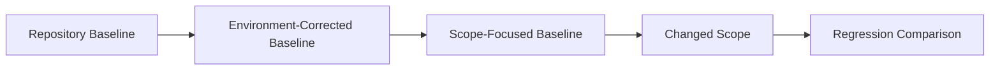

# Baseline Evidence and Verification Surface

## Purpose

Baseline evidence distinguishes an existing repository condition from a change
regression. It is evidence recorded in a Change Contract, Loop Contract, or
Project context; it is not a new Ledger, lifecycle state, or delivery gate.



## Repository Baseline

The Repository Baseline is the observed result before any environment correction.
Record pre-existing test failures, formatting or lint failures, compile failures,
missing migrations, warnings, and environment failures with the command and
boundary that exposed them.

## Environment-Corrected Baseline

The Environment-Corrected Baseline is observed after correcting only non-product
prerequisites, such as a required service, environment variable, repository-owned
migration, fixture, profile, container, or rate-limit contamination. It MUST NOT
change product implementation to make a baseline green.

## Scope-Focused Baseline

The Scope-Focused Baseline is the direct validation surface for the intended
change. It answers both questions precisely:

```text
Before change: what exactly is red?
After change: what exactly changed?
```

A red repository baseline does not automatically block delivery. Pre-existing
failure attribution MUST be established before claiming a regression. A corrected
environment result does not erase the Repository Baseline; both remain relevant.

## Verification Surface

Record this inventory before interpreting a passing command:

| Field | Record |
| --- | --- |
| Build system | The actual build/test runner. |
| Default test command | The command normally invoked by maintainers or CI. |
| Actual test includes | Tests the command selected in this run. |
| Actual test excludes | Tests excluded by configuration, naming, tags, filters, or profiles. |
| Tests not reached by default | Known suites outside default discovery. |
| Focused validation | Narrow command(s) that exercised the scope. |
| Full validation | Broad command(s), including observed limits. |
| Required services | Databases, queues, browsers, containers, or other dependencies. |
| Required environment | Variables, credentials presence, data state, and local prerequisites. |
| Required profiles | Test, integration, feature, or deployment profiles. |
| CI validation | CI commands and any difference from local discovery. |
| Known discovery gaps | Gaps supported by configuration or command output. |

> A successful test command proves only the tests it actually selected.

This applies to Maven, Gradle, Flutter, Jest, Vitest, pytest, Cargo, Go test, and
other hosts. Static validation may require that this inventory be recorded, but it
MUST NOT infer full product coverage from a build-system name or a zero exit code.

## Recording Rules

- Attribute observed results to commands, files, reports, or Git boundaries.
- Mark a cause as inferred when direct diagnosis is incomplete.
- Record unavailable validation as unverified rather than silently treating it as
  passed.
- Do not create `BASELINE-LEDGER.md`; baseline evidence belongs in the existing
  contract or context artifact.
