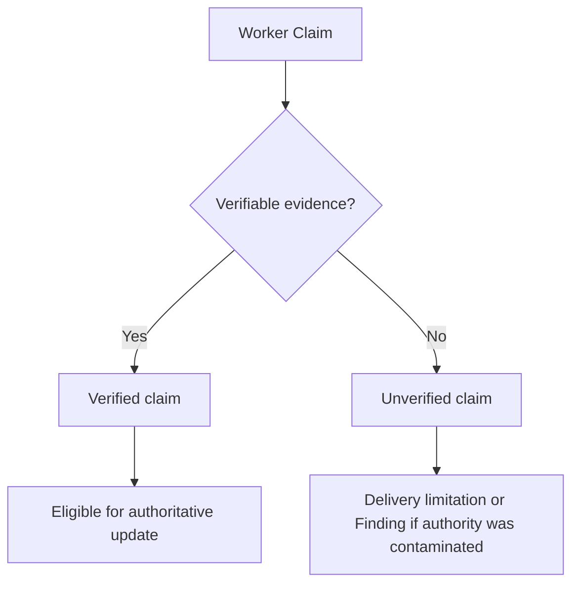
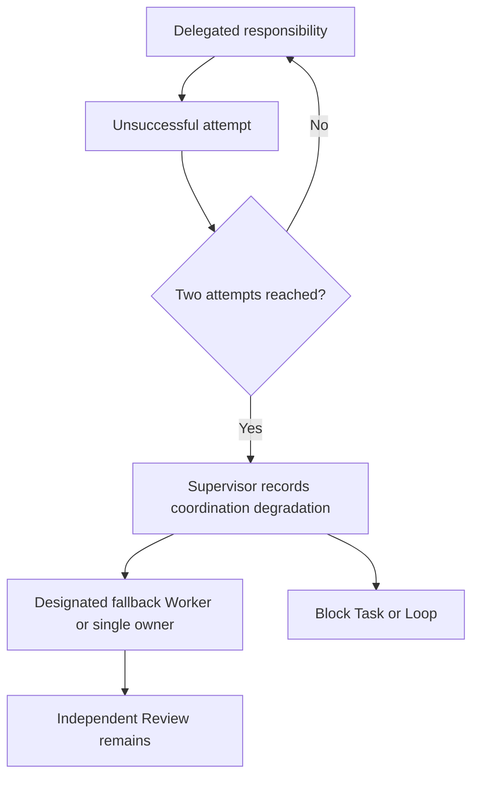

# Coordination Necessity and Delegation Fallback

## Product Risk and Coordination Risk

Product Risk concerns the harm or complexity of the change itself: security, data,
transactions, idempotency, sensitive data, compatibility, partial success, or
production impact. It determines appropriate Review Depth, Validation Depth, and
Evidence Depth.

Coordination Risk concerns whether safe delivery requires structured work between
owners. It determines whether Full Loop governance is justified. High product risk
does not by itself prove that multiple Workers are required.



Full Loop SHOULD be selected when stronger coordination governance is required to
deliver safely, not merely because a change is important. This is a provisional,
evidence-backed heuristic, not a mathematical rule or Normative Invariant.

## Coordination Necessity

Before selecting Full Loop, record the following:

| Question | Evidence |
| --- | --- |
| Multiple implementation owners required | |
| Independent Worker value | |
| File ownership can be separated | |
| Deliverables can be independently verified | |
| Integration ordering is non-trivial | |
| Dedicated Integration Record required | |
| Active recovery required | |
| Formal Rework likely | |
| Single-owner implementation would be unsafe or opaque | |
| Expected coordination cost | |
| Coordination benefit | |

Use the resulting evidence proportionally:

- High product risk and low coordination necessity tends to Lightweight with
  appropriate Review.
- High product risk and high coordination necessity tends to Full Loop.
- Low product risk and high coordination necessity requires a specific assessment
  of the actual coordination need.
- Low product risk and low coordination necessity tends to Lightweight.

File count remains supporting evidence only.

## Specialist-Reviewed Lightweight

Lightweight MAY load a risk-matched specialist Reviewer, including Security, Data,
Compatibility, Accessibility, or Operations. It remains Lightweight; a
specialist-reviewed Lightweight configuration is not a new mode or state. Spec and
Standards remain permanent review axes and specialists do not replace them.

Escalate Lightweight when a Major or Blocker Finding appears, multiple
implementation owners become necessary, a dedicated Integration Record is needed,
cross-responsibility coordination emerges, corrections exceed the recorded budget,
the Change Contract becomes dishonest, active recovery is required, or formal
Rework cannot be expressed honestly in Lightweight. The presence of a Security
Reviewer alone does not require Full Loop.

## Worker Failure Budget

The same delegated responsibility SHOULD default to no more than two unsuccessful
Worker attempts. This is a provisional coordination-cost heuristic, not a platform
limit or a new Task status.

An unsuccessful attempt includes no output, no verifiable Delivery, clear scope
failure, an Agent or tool failure with no useful artifact, or a Delivery that fails
the Task Contract minimum. A valid Finding, ordinary Reviewer-requested Rework, or
an environment error discovered before the Worker begins does not consume this
budget.

At the budget, the Supervisor chooses one of: reassign to one designated fallback
Worker, collapse implementation ownership to one Worker, or block the Task/Loop.
Do not retry indefinitely and do not rewrite revision history to hide failures.



## Ownership Collapse in Full Loop

Ownership collapse preserves Full Loop governance while reducing implementation
ownership. The Supervisor records the degradation and the designated fallback
Worker; the Integrator records the changed ownership boundary. The Reviewer remains
independent. The Task Ledger, Finding Ledger, Integration, Review, Closure, and
their existing authorities remain in force.

Reviewer and Integrator roles MUST NOT become code implementers merely because
Workers failed. A Supervisor taking over implementation without an ownership record,
resetting task revisions, or deleting failed Deliveries is also prohibited.

## Verifiable Worker Claims

Worker Deliveries use this table for material factual claims:

| Claim | Evidence | Verification | Git Boundary |
| --- | --- | --- | --- |

They also state:

```md
## Unverified Claims

- None.
```

A Worker summary is not evidence. A material claim must be located in a file, code,
test, command, log, commit, database assertion, or authoritative external source.
Unsupported claims discovered before an authoritative decision go in Delivery
limitations. Claims that already contaminated Task, Integration, or Review decisions
become a Protocol or Process Finding, not an Execution Infrastructure Incident or
Product Finding by default. Do not create `CLAIM-LEDGER.md` or
`EVIDENCE-LEDGER.md`.
