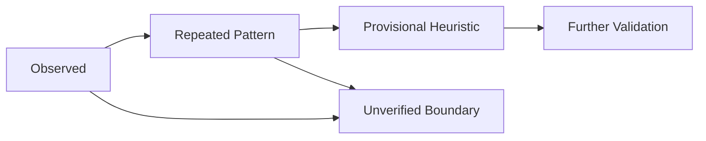

# Evaluation Synthesis and Protocol Calibration

## Purpose and Boundary

This document calibrates LoopPilot from four bounded MMGH experiments.
It distinguishes direct evidence from reusable guidance without claiming a
strict A/B comparison, cross-project replication, production certification, or
universal superiority for either protocol mode.

The five evidence labels below are documentation labels. They are not lifecycle
states, Finding severities, Ledgers, Barriers, or new authority.

## Evidence Levels

### Observed

An outcome directly inspected in one identified experiment through Git, files,
tests, authoritative Ledgers, Review, or Closure evidence.

Examples include two EXP-001 implementation Workers producing no usable output,
EXP-002 using fewer protocol artifacts than EXP-001, a Worker 429 during EXP-004,
and the EXP-004 injected failure committing its SQLite mutation exactly once.

### Repeated Pattern

A materially similar observation present in at least two independent
experiments. Repetition increases confidence but does not establish universal
causation.

Repeated patterns in the MMGH series include:

- cross-layer risk benefited from risk-specific Review;
- Agent and tool failure did not itself prove a Product Finding;
- Checkpoint evidence covering Git, authority, state sources, and an Exact Resume
  Point supported bounded recovery;
- Full Loop governance produced meaningful control evidence with substantial
  protocol cost across the Full Loop experiments.

### Provisional Heuristic

Guidance supported by multiple observations and no known direct counterexample,
but not yet validated through controlled comparison or cross-project
replication.

- Prefer Lightweight for a bounded, single-owner, local change with direct
  characterization tests and no data, security, cross-runtime, or partial-success
  boundary.
- Prefer evaluating Full Loop for cross-language or cross-runtime contracts,
  sensitive data, transactions, partial success, useful multi-Worker work, or
  specialist Review.
- Target four to seven Lightweight protocol or experiment artifacts as a
  cost-control heuristic, then explain the excess and reassess the mode.

These are decision aids for the Supervisor, not an automatic mode-selection
runtime.

### Normative Invariant

A safety or authority rule that remains binding independently of the MMGH
observations.

- Evidence must not be fabricated or silently upgraded.
- Authorization for edit, commit, push, release, and deploy remains
  action-specific.
- Accepted, integrated, committed, released, and deployed are not synonyms.
- Detailed artifacts do not own authoritative status.
- The Integrator records decisions and transitions but does not accept risk.
- A Reviewer does not modify the implementation being reviewed.
- Failed or skipped verification is disclosed.

Ordinary engineering preference must not be promoted to this level merely
because an experiment happened to support it.

### Unverified

Claims not established by this evaluation include strict same-task
Baseline/Lightweight/Full Loop A/B results, replication in a second project,
production deployment, exact token cost, automatic mode or Reviewer selection,
compatibility with every host, long-term maintenance benefit, resistance to real
security attacks, production data reliability, and overall MMGH
re-architecture.

## Evidence Progression

Progression is not automatic.

New evidence can retain, narrow, revise, or reject a heuristic. A counterexample
must be recorded rather than hidden.

## Calibrated Conclusions

The four experiments support proportional protocol loading. EXP-002 shows that
a small, single-owner lifecycle hook can retain tests and honest limitations
without loading the Full Loop set. EXP-003 and EXP-004 show why cross-runtime
trust and transaction or partial-success boundaries benefit from explicit
contracts, specialist Review, and integration evidence. EXP-001 shows both the
governance value of independent review and the cost of applying Full Loop to a
small extraction.

Execution failures are also distinct evidence. No-output Workers, rate limits,
tool timeouts, host compaction, dependency outages, CI infrastructure failures,
and local packaging failures are recorded as Execution Infrastructure Incidents
unless evidence proves a product or protocol defect. A missing verification can
block Review or Closure while remaining an infrastructure incident.

## Architecture Calibration

OOP, dependency injection, DDD, MVVM, and zero-copy remain evidence-selected
engineering considerations. Use the smallest applicable pattern when ownership,
domain invariants, test seams, view and application coupling, allocation
profiles, or benchmarks justify it. Full Loop does not require a DDD model, a
large DI framework, MVVM forwarding layers, classes for pure helpers, or
zero-copy changes without measurement.

## Migration Status

- Phase 1 through Phase 5: statically implemented.
- Phase 6, Real-project behavioral evaluation: partially observed through MMGH
  EXP-001 to EXP-004 and not generally validated.
- Phase 7, Evidence synthesis and protocol calibration: statically implemented
  by this repository revision.
- Phase 8, Cross-project Replication and Controlled Comparison: not implemented.

Phase 8 should include at least one second-project replication, a controlled
same-task comparison, cross-host recovery and Reviewer observation, or long-term
maintenance and regression observation. This Phase 7 change does not execute
Phase 8.
