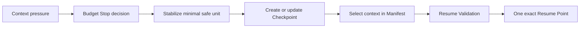
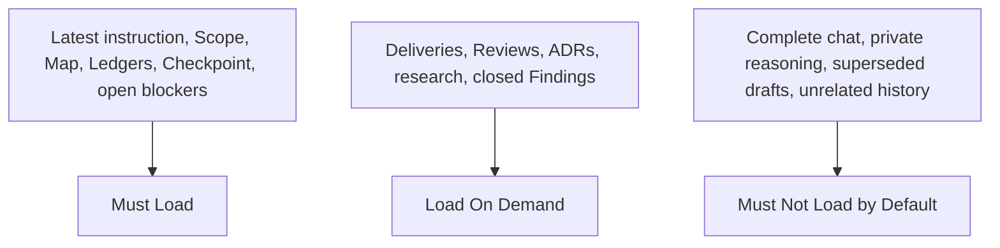
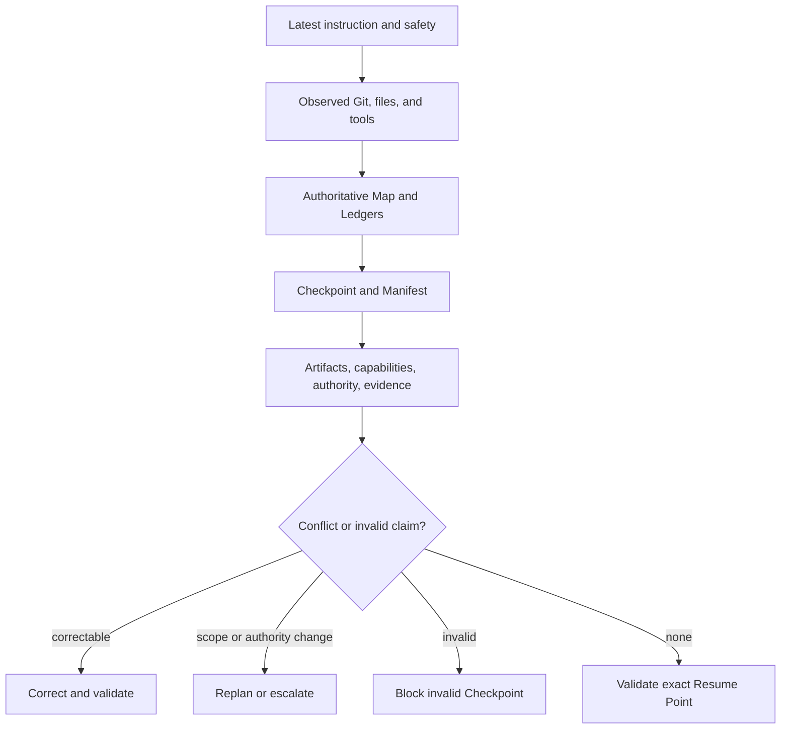
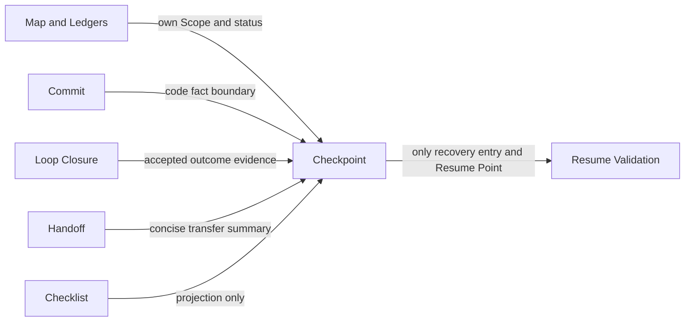
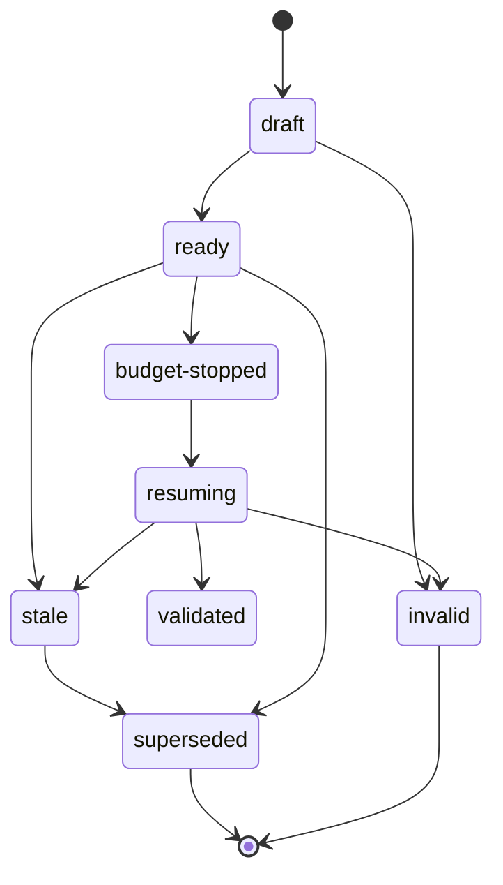

# Full Loop Checkpoint and Context Recovery

Phase 4 defines static recovery contracts for Full Loop Mode. It does not read an
exact token balance, compact a model, create a Checkpoint automatically, start a
new session, transfer an Agent, inspect Git automatically, or execute a Resume
Point. Each action remains host-native or uses an equivalent observed capability.

## Recovery Flow

## Checkpoint Contract

`CHECKPOINT.md` is the only authoritative recovery entry. A Checkpoint is a minimal
trusted index of the verified repository boundary, authoritative state sources,
unfinished work, blockers, permission state, evidence to revalidate, and exactly
one actionable Resume Point. Active IDs use `CHECKPOINT-NNN`.

It is not a conversation transcript, complete Ledger, collection of Deliveries or
Reviews, Loop Closure, Commit substitute, Handoff, Checklist, reasoning log, or
runtime. It does not own Project Scope, Loop status, Task status, or Finding status.

Checkpoint Status is one of `inactive`, `draft`, `ready`, `budget-stopped`,
`resuming`, `validated`, `stale`, `superseded`, `blocked`, or `invalid`. Only one
Checkpoint may claim the current recovery boundary. A replacement records both
`Replaces` and `Superseded by`; old failure evidence remains available.

## Recovery Boundary

The Recovery Boundary records repository, branch, verified HEAD, working-tree and
uncommitted-diff state, integrated boundary, latest Closure, authoritative Map and
Ledgers, current Scope, open blockers, permissions, and evidence freshness. A dirty
tree, unavailable tool, or uncommitted change is a fact to record, not a reason to
invent a Commit. Current observed Git, file, test, and tool reality overrides stale
Markdown.

## Context Pressure and Budget State

Context Pressure is qualitative: `unknown`, `normal`, `elevated`, `high`, or
`critical`. It describes recovery risk, not an exact token count. Budget State is
separate: `unbounded-unknown`, `bounded`, `healthy`, `constrained`,
`high-pressure`, `critical`, `budget-stopped`, `exhausted`, or `not-applicable`.

At `normal`, continue proportionate work. At `elevated`, stop repetition and
unrelated loading. At `high`, stop low-priority Tasks, finish only the smallest safe
verifiable unit, update authoritative state, record evidence and omitted checks,
and prepare recovery artifacts. At `critical`, do not create Workers, begin Rework,
integrate, or modify code: persist observed state, record one Resume Point, mark the
Checkpoint `budget-stopped`, and stop.

The Loop Map retains its existing `budget-exhausted` state for a Loop whose budget
boundary prevents execution. The Checkpoint's `budget-stopped` is the more precise
recovery fact for a deliberate stop before forced exhaustion; it does not create a
second Loop status.

## Minimal Safe Unit and Budget Stop

A Minimal Safe Unit is the smallest honest boundary that is internally coherent,
saved, inspectable, and distinguishable from unfinished work. Examples include a
completed Delivery persisted with evidence, an Integration Record that explicitly
lists unintegrated inputs, a reproducible failing test plus registered Finding, or
an unchanged implementation with an exact diagnostic Resume Point. Half-written
syntax, an unrecorded conflict, a fabricated pass, or partial work labelled complete
is not safe.

Budget Stop triggers when pressure is high or critical, a declared budget is at its
boundary, or continued work risks losing verified state before it can be persisted.
It MUST record the trigger, pressure, safe unit, authoritative updates, persisted
state, unfinished work, failures and skipped checks, current authority, and one
exact Resume Point.

Budget pressure MUST NOT skip Spec Review. Budget pressure MUST NOT skip Standards
Review. It MUST NOT hide failed tests, convert partial work to completed, close a
Loop or Finding, remove blockers, lower severity, expand permission, fabricate a
Commit or Checkpoint, or justify repeating an unchanged failed strategy.

## Context Compaction Manifest

The Manifest explains what a resumed Supervisor should load, load only on demand,
and avoid by default. It is neither status nor Recovery authority.

Must Load includes the latest user instruction, active Project and Loop contracts,
current authoritative Map and Ledgers, current Checkpoint, Scope, business
invariants, authority, open blocker or major Findings, and evidence needed by the
Resume Point. Load On Demand includes detailed Deliveries, Reviews, Rework records,
ADRs, research, historical Closure evidence, and closed Findings only when a
specific conflict or revalidation needs them. Must Not Load by Default includes the
complete chat, private reasoning, superseded drafts, large raw logs, unrelated
files, and all historical Loop artifacts.

Over-compaction can omit Scope, blockers, authority, or evidence gaps and make a
Resume Point unsafe. Under-compaction can reload complete history, obscure current
facts, and exhaust context again. The Manifest must justify a sufficient but
minimal selection. Exclusion is not deletion.

## Resume Validation

A resumed Supervisor validates before acting:

1. read the latest user instruction and safety constraints;
2. inspect the actual repository, branch, HEAD, working tree, and files;
3. read `PROJECT.md`, `LOOP-MAP.md`, the current Loop Contract,
   `TASK-LEDGER.md`, `FINDING-LEDGER.md`, and `CHECKPOINT.md`;
4. apply the Manifest's Must Load selection;
5. check referenced artifacts, required Skills, tools, network, Reviewer access,
   and current action-specific authority;
6. reproduce required evidence and expose conflicts or invalidated claims;
7. correct or supersede stale recovery facts; and
8. decide `validated`, `validated-with-corrections`, `blocked`,
   `invalid-checkpoint`, `replan-required`, or `cancelled` before resuming.

Resume Validation may correct stale branch, HEAD, summaries, references, completed
Resume Points, capability facts, permission facts, supersession, and Must Load
selection. It may not change the user goal, Project or Loop Scope, risk acceptance,
Finding severity, or commit, push, release, and deploy authority.

## Fact Priority and Exact Resume Point

When records conflict, use this priority: latest user instruction and platform
safety; current observable repository, file, and tool reality; authoritative Map
and Ledgers; the current validated Checkpoint; detailed contracts and records;
Handoff and Checklist projections; historical summaries. Correct conflicts
explicitly rather than choosing a convenient record.

There is exactly one primary Resume Point. It names a stable item, uses an explicit
action verb, lists required inputs and tool or Skill, states an expected observable
result, and defines a stop or escalation condition. “Continue previous work,”
“finish the task,” “check what remains,” “proceed as before,” and “resume normally”
are invalid. The Next Highest-Value Action is subsequent work, not a competing
Resume Point.

## Artifact Boundaries

A Commit is a code fact boundary; it does not establish recovery readiness. A
Checkpoint without a Commit may be honest when commit is unauthorized, but must
record the dirty or uncommitted boundary and risk. A mismatched actual HEAD makes
the record stale or conflicting; recovery must not reset Git automatically.

Loop Closure records delivered outcomes, Review, Findings, three-layer Acceptance,
and Barriers. It does not own Recovery status. A ready Checkpoint does not close a
Loop, and accepted Closure does not make a Checkpoint ready. `LOOP-MAP.md` remains
the Loop status authority.

Handoff is a concise transfer summary and may reference the Checkpoint; it cannot
replace it or transfer authority. Checklist is a projection and may show a recovery
hint; it cannot own Recovery status or override the exact Resume Point. Lightweight
work may continue to use a compact Checklist or Handoff without Full Loop recovery
artifacts.

## Staleness, Invalidity, and Supersession

A Checkpoint is `stale` when recoverable facts changed: user Scope, HEAD, working
tree, Ledger summaries, permission, capability, research freshness, referenced
files, evidence, Loop state, or a completed Resume Point. Resume Validation corrects
or replaces it.

A Checkpoint is `invalid` when it fabricates evidence or a Commit, claims absent
authority, conflicts with another current recovery authority, cannot identify its
Project or Loop, depends entirely on unsaved context, overrides the latest user
instruction or safety, or has irreconcilable Ledgers. It MUST NOT be used.

A `superseded` Checkpoint was valid history but a newer Checkpoint now owns the
current recovery boundary. Both directions of the replacement relationship remain
traceable.

## Intra-Loop and Inter-Loop Recovery

Intra-loop recovery loads the current Task, Integration, Review, Finding, Rework,
or Closure boundary needed by the Resume Point. Inter-loop recovery starts from the
previous Closure and Commit boundary, prior Checkpoint, Project Loop Map, next Loop
Contract, cross-Loop dependencies, open cross-Loop Findings, relevant ADRs, and
Project risks. It does not reload the previous Loop's full process history.

## Static Validation Boundary

The public validator checks required files, headings, enumerations, identifier and
reference shape, inactive-template truthfulness, actionable Resume Points, explicit
Budget Stop fields, recovery-authority discipline, and obvious permission or
readiness contradictions. It does not calculate tokens, select optimal context,
create or correct a Checkpoint, inspect Git, load files, rerun tests, switch
sessions, transfer Agents, or execute recovery.
