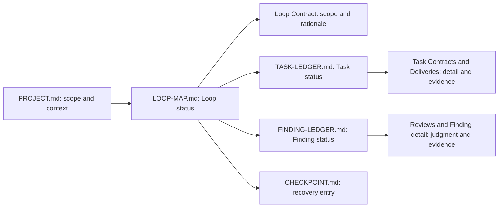
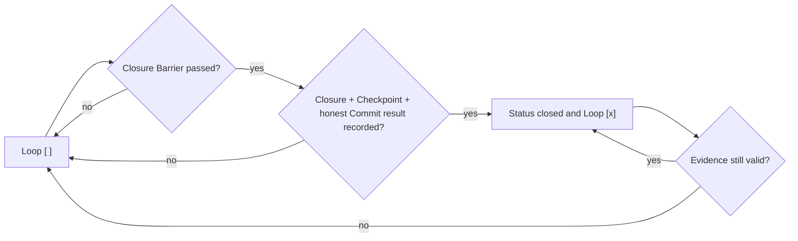

# Full Loop Contracts and Authoritative Ledgers

Phase 2 adds static Full Loop templates and structural validation. It does not
create active instances, execute transitions, schedule Agents, close Findings,
commit changes, recover context, or implement Phase 3 delivery artifacts.

## Template Relationships

The [template directory](../.looppilot/full-loop/README.md) contains the Project
Loop Map, Loop Contract, Task Ledger, and Finding Ledger templates. A real Project
copies them to instance names only when Full Loop Mode is justified.



Contracts, Deliveries, Reviews, and future Finding detail remain traceable content;
they do not own lifecycle status. The Loop Map and Ledgers are compact projections,
not stores for full delivery or review text.

## Loop Grouping and Contract

A Loop groups changes because they share a user or system outcome, business
invariants, contracts, integration risk, acceptance, or recovery boundary. A
Grouping Rationale MUST explain that cohesion and why the result can be accepted,
committed when authorized, and resumed independently. File proximity, a feature
label, or a frontend/backend split is insufficient by itself.

The Loop Contract records Objective, included and excluded changes, outcomes,
business rules, Engineering Concern Matrix, Architecture Profile, Task DAG, Worker
Plan, Reviewer Matrix, Integration Strategy, three-layer Acceptance, five Barriers,
Budget, stop conditions, Authority, risks, and open decisions. Its `Contract
Status` is one of `inactive`, `draft`, `ready`, `approved`, or `superseded`.
It MUST NOT copy the Loop lifecycle status owned by `LOOP-MAP.md`.

The Task DAG records stable Task IDs, outcomes, dependencies, and contract links.
Spec and Standards Review are mandatory axes. Conditional Reviewers are selected
only from material Engineering Concern Matrix risks; they are not all mandatory by
default.

## Loop Map and Loop Status

Loop Map document status is one of `inactive`, `active`,
`partially-completed`, `blocked`, `completed`, `cancelled`, or
`budget-stopped`.

Loop status is one of:

```text
planned | contracted | executing | implemented | integrating | integrated
reviewing | reworking | accepted | committed | checkpointed | closed
blocked | failed | budget-exhausted | cancelled | replan-required
```

The normal semantic path is:

```text
planned -> contracted -> executing -> implemented -> integrating -> integrated
-> reviewing -> accepted -> committed -> checkpointed -> closed
```

Review may enter `reworking`, then return to `integrating` or `reviewing`.
No-Finding review may move directly from `reviewing` to `accepted`. `blocked`,
`failed`, `budget-exhausted`, `cancelled`, and `replan-required` are explicit side
paths. A non-applicable state MAY be skipped, but its Barrier MUST NOT be skipped.
This phase validates enum membership and static evidence; it is not a runtime state
machine.

## Completion Projection



`[ ]` means the Loop has not passed the Closure Barrier. `[x]` means only that the
authoritative Loop status is `closed` and required Closure evidence remains valid.
`accepted`, `committed`, and `checkpointed` are distinct pre-closure states and MUST
remain unchecked. `cancelled`, `blocked`, `failed`, and `budget-exhausted` also MUST
remain unchecked. Deferral is recorded outside the completed projection and MUST
NOT produce `[x]`. Task completion, Task integration, Reviewer approval, or a
Checklist mark MUST NOT close a Loop.

## Commit Policy

Each Loop Contract defines whether a commit is required, whether current authority
exists, and the expected result. A Loop Map projection records these facts
separately:

- `Commit Required`: `yes`, `no`, or `not-applicable`;
- `Commit Authorized`: `yes`, `no`, or `not-applicable`;
- `Commit Result`: an observed commit reference, `not-created-not-authorized`,
  `not-created-not-required`, or `not-applicable`.

If a required commit is not authorized, the Integrator records
`not-created-not-authorized` and the Loop remains unchecked in the contract-defined
waiting or blocked state. It MUST NOT fabricate a commit or infer push authority.
When a commit is not required or not applicable, a Loop may close only if the
Contract explicitly permits that policy, records the corresponding honest Commit
result, and all other Closure evidence is present.

## Task Ledger

The Task Ledger reuses the existing Task Contract lifecycle rather than creating a
parallel status language:

```text
proposed | assigned | in-progress | submitted | under-review
revision-requested | approved | rejected | blocked | cancelled | integrated
```

Task types are `implementation`, `contract`, `research`, `integration`, `test`,
`documentation`, `migration`, `operations`, `rework`, and `review-support`.
Reviewer work remains independent judgment rather than an implementation Worker
type.

`under-review` is the existing Task-level independent check. `approved` means the
Task is ready for integration after that check; it is not Loop Acceptance.
`integrated` means its Delivery entered the unified Loop result. Formal Loop-level
Review happens after the Integration Barrier and creates Findings. A Task status
MUST NOT map directly to Loop `[x]`.

The Supervisor decides business transitions. The Worker submits Delivery but does
not edit authoritative status. The Reviewer supplies a decision but does not edit
the Ledger. The Integrator records the authorized transition. Normal Task IDs use
`TASK-001`; rework IDs use `TASK-001-R1`.

## Finding Ledger

Finding severity is `blocker`, `major`, `minor`, or `suggestion`. Finding status is:

```text
open | triaged | assigned | in-rework | ready-for-review | verified | closed
deferred | risk-accepted | rejected | duplicate | reopened
```

The normal correction path is:

```text
open -> triaged -> assigned -> in-rework -> ready-for-review -> verified -> closed
```

`deferred`, `risk-accepted`, `rejected`, and `duplicate` require traceable
disposition; a previously dispositioned Finding may become `reopened`. A
`risk-accepted` Finding links an explicit Supervisor decision. A `duplicate`
Finding links the original Finding. A `closed` Finding includes verification
semantics.

The Reviewer creates Finding content, the Integrator registers it, the Supervisor
triages and approves disposition, the Worker implements a Rework Task, the Reviewer
verifies, and the Integrator records the resulting status. The Integrator MUST NOT
change original judgment, lower severity, close a Finding, accept risk, or delete
an unresolved Finding without the responsible decision.

An unresolved `blocker` prevents Closure. Every `major` must be closed, deferred,
risk-accepted, or linked to an explicit Supervisor decision. Minor and suggestion
policy is defined by the Loop Contract. The
[Phase 3 protocol](full-loop-delivery-review-and-closure.md) adds the detailed
Finding, Rework, Review Report, Integration Record, and Loop Closure artifacts while
leaving these Ledger authorities unchanged.

## State-Source Invariants

- `LOOP-MAP.md` MUST be the only authoritative source of Loop status.
- `TASK-LEDGER.md` MUST be the only authoritative source of Task status within a Full Loop.
- `FINDING-LEDGER.md` MUST be the only authoritative source of Finding status within a Full Loop.
- `CHECKPOINT.md` MUST be the only authoritative recovery entry point.
- Detailed artifacts MUST NOT independently redefine authoritative status.
- A Checklist MAY summarize state but MUST NOT override an authoritative Ledger.
- Every projection MUST identify its authoritative source.
- The Integrator records only a transition supported by the responsible decision or evidence.
- Observable Git, file, build, test, and tool facts override stale Markdown.
- Conflicting state MUST be corrected rather than silently reconciled.

Lightweight Mode keeps its compact Checklist and shared-state summary. It MUST NOT
incur Full Loop Map or Ledger overhead for simple work. In Full Loop Mode, the
Checklist is a recovery aid and projection only.

Phase 4 does not change these authorities. The
[Checkpoint and context-recovery protocol](full-loop-checkpoint-and-context-recovery.md)
uses the Map and Ledgers as required recovery inputs while keeping `CHECKPOINT.md`
as the one recovery entry. Its Manifest and Resume Report are context-selection and
validation evidence, not additional status sources.

Phase 5 also preserves these authorities. Project-level Findings are routed into an
existing, reopened, or new remediation Loop and then use that Loop's
`FINDING-LEDGER.md`; Project Acceptance does not create a parallel Ledger.
Closed Loop status is only an input to Cross-Loop Validation and never sufficient
for Project acceptance or closure. See the
[Project Closure protocol](project-closure-and-final-delivery.md).
