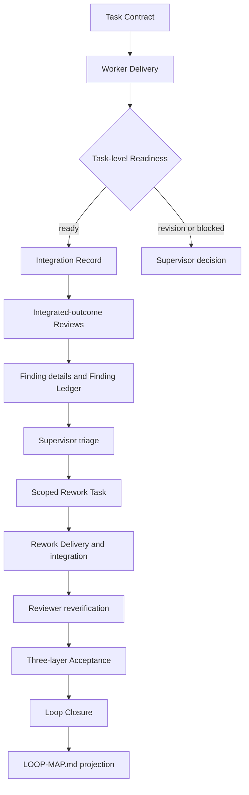
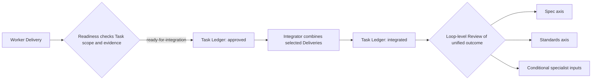
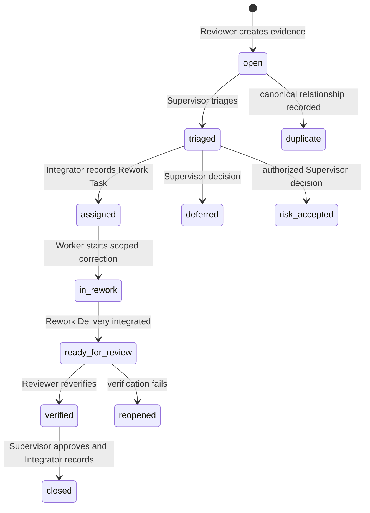
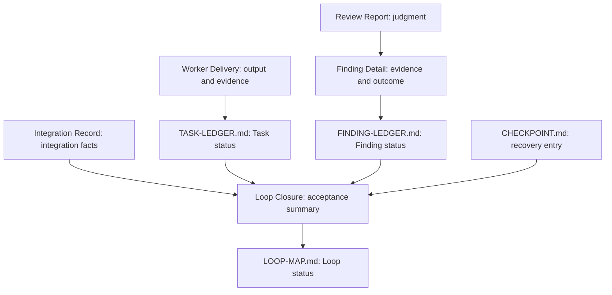

# Full Loop Delivery, Review, Rework, and Closure

Phase 3 adds inactive templates and static invariants for the Full Loop delivery
cycle. It does not execute the cycle, create Agents or Tasks, update a Ledger,
integrate branches, judge severity, accept risk, commit, recover context, or close a
Loop. Real behavior and named-host compatibility remain unverified.

## Delivery-to-Closure Flow

## Worker Delivery

A Worker Delivery references one Task Contract and reports actual scope, changed
artifacts, deviations, failed and skipped checks, evidence, limitations, risks, and
requested decisions. Active Delivery status is one of `completed`, `partial`,
`blocked`, `failed`, or `scope-change-required`. Multiple versions may be retained;
a later Delivery does not erase earlier failures.

The Worker describes observations only. Self-reported completion does not approve
the Task, satisfy the Integration Barrier, grant new authority through a Skill, or
change Task status. `TASK-LEDGER.md` remains authoritative.

## Task-Level Readiness

Readiness determines whether a Delivery may enter integration. It checks the Task
Contract reference, status, actual and authorized scope, required deliverables and
evidence, disclosed failures and deviations, conflict groups, assigned-Skill
boundaries, and integration notes. Its results are:

- `ready-for-integration`
- `revision-required`
- `blocked`
- `rejected`

The result is projected to the Task Ledger: `submitted` means a Delivery exists,
`under-review` means Readiness is running, `revision-requested` means it failed the
entry conditions, `approved` means it is ready to integrate, and `integrated` means
it entered the unified result. `approved` is not Loop review and `integrated` is
not Loop acceptance.

Readiness may be performed by an independent Reviewer, the Supervisor, or an
Integrator performing mechanical checks. When independence is required, the
implementer cannot self-approve. Readiness does not replace Spec, Standards,
specialist risk review, the Integration Barrier, or Loop Acceptance.

## Integration Record

The Integration Record lists included and excluded Deliveries, integration order,
file ownership and conflict groups, applied changes, unintegrated work, actual
build and integration-test commands, evidence, limitations, and the Integration
Barrier result. `integrated` means a unified result was formed and the Integration
Barrier passed; it does not mean `accepted`, `closed`, or `[x]`.

The Integrator resolves mechanical conflicts such as ordering or non-semantic text
combination. A conflict about behavior, requirements, architecture, policy, or
scope is semantic and goes to the Supervisor. The Integrator records decisions but
does not invent them, alter Reviewer judgment, change scope, or accept risk.

## Loop-Level Review

Formal review normally examines the integrated Loop outcome and its actual
boundary. A Review Report records reviewer identity and type, evidence examined,
checks, findings, limitations, contribution to the Spec and Standards axes,
verdict, and reverification requirements. Its verdict is `pass`,
`pass-with-findings`, `rework-required`, or `blocked`.

Final review is conjunctive: Spec Review and Standards Review must both pass.
Risk-driven domain, data, concurrency, security, operations, performance,
architecture, frontend, compatibility, test, code-quality, accessibility,
compliance, factual-accuracy, citation, methodology, structure, visual, or domain
expert Reviewers contribute to one or both axes. They need not repeat both complete
axes. One axis cannot compensate for the other, and `pass-with-findings` does not
dispose of Findings.

Reviewers judge and create Findings; they do not modify implementation, update an
authoritative Ledger, accept risk, or close the Loop.

## Finding Detail and Triage

A Finding Detail references its Loop and Review and supplies a unique Finding ID,
category, Ledger-consistent severity, affected scope, evidence, expected and actual
behavior, risk, required outcome, verification method, and rework guidance. It does
not contain authoritative status: `FINDING-LEDGER.md` owns that projection.

Categories are extensible and may use `other` with an explanation. The validator
does not infer domain categories or severity. A `blocker` or `major` needs a
concrete required outcome; vague criticism is not a verifiable Finding.

The Supervisor decides current-Loop relevance, rework, Loop or design changes,
deferral, rejection, and authorized risk acceptance. The Integrator records that
decision. Multiple Reviewers retain their original reports. Duplicate Findings
point to a canonical Finding with evidence; the Integrator may record the
relationship but may not rewrite a report, lower severity, reject a Finding, or use
last-writer-wins.

## Rework and Reverification

Rework uses a distinct `TASK-NNN-RN` Task linked to its parent Task and one or more
registered Findings. The contract states required outcome, allowed and forbidden
scope, required changes and verification, Reviewer requirements, dependencies,
authority, revision number, revision budget, and escalation conditions.

The same failed approach cannot be repeated without a material strategy change.
When the budget is exhausted, the Supervisor redesigns, splits the Task, changes
the Worker, narrows or changes the Loop, asks the user, defers, or stops. Rework
does not acquire commit, push, release, or deploy authority from the Finding.

After a Rework Delivery passes Readiness and is integrated, the original Reviewer
rechecks it. An authorized equivalent may substitute only with a recorded reason.
A pass permits `verified`; a failure produces `reopened`. Closure requires a
Supervisor decision and Integrator recording. Risk acceptance is not verification.

## Loop Closure

Loop Closure summarizes the objective outcome, included and excluded work,
completed and unintegrated Tasks, integrated boundary, review coverage, Finding
dispositions, three-layer Acceptance, five Barriers, residual risks, deferred work,
commit result, Checkpoint relationship, next inputs, workspace state, and the
decision evidence.

Functional, Engineering, and Delivery Acceptance must each pass. Contract,
Implementation, Integration, Review, and Closure Barriers must each be satisfied.
Mandatory Tasks must meet the Contract, Spec and Standards reviews must pass,
conditional reviews must meet the Matrix, no unresolved blocker may remain, and
every major disposition must be explicit. Functional correctness alone is
insufficient.

Commit authorization is independent from push. If a required commit is not
authorized, Closure records `not-created-not-authorized` and the Loop cannot close.
Phase 3 records only the Checkpoint relationship. It cannot claim recovery-ready
without a valid `CHECKPOINT.md`; recovery behavior remains Phase 4 work.

Closure status `accepted` is not authoritative Loop status. Only after Closure
Barrier evidence is complete may the Integrator project `closed` and `[x]` to
`LOOP-MAP.md`.

## Authoritative State Projection

The authorities remain unchanged:

| State | Only authority |
|---|---|
| Task status | `TASK-LEDGER.md` |
| Finding status | `FINDING-LEDGER.md` |
| Loop status | `LOOP-MAP.md` |
| Recovery entry | `CHECKPOINT.md` |

The responsible role supplies a decision or evidence. The Integrator verifies that
it is recordable and updates the corresponding authority. Detailed artifacts and
Checklists remain projections and cannot create business decisions.

## Static Validation Boundary

The public validator checks required files, headings, enumerations, identifier
formats, inactive-template truthfulness, authority boundaries, state-source
discipline, and obvious contradictions. It does not deduplicate Findings, infer
severity, create or assign Tasks, execute review, merge work, update state, close a
Loop, commit, or create or validate a real Checkpoint.

The templates and regression fixtures establish only static protocol conformance.
Real Worker behavior, multi-Agent integration, concurrent conflicts, reviewer
independence, automatic severity, deduplication accuracy, revision-budget stopping,
automatic Closure quality, recovery, Project Closure, named-host compatibility,
and A/B behavior remain unverified.
