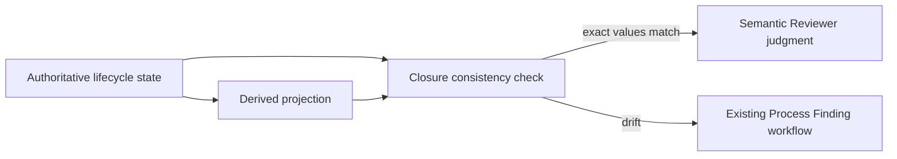
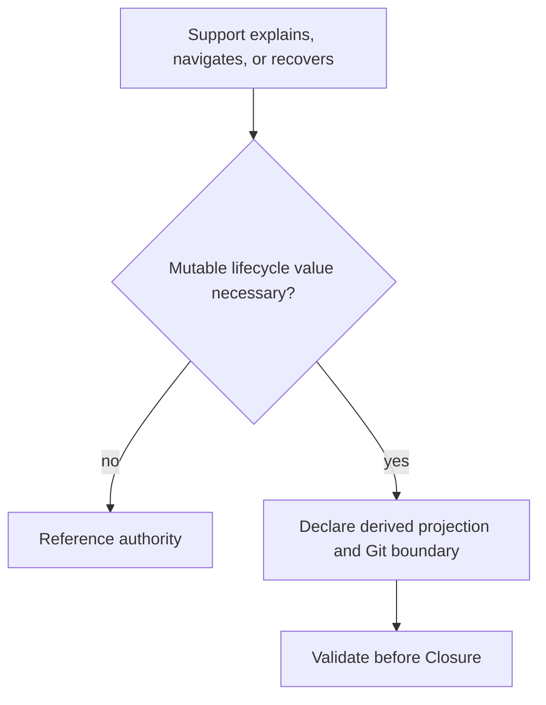

# Lifecycle Authority and Derived Projections

LoopPilot keeps lifecycle truth in existing host-native files. A lifecycle fact
MUST have one authoritative source. Supporting artifacts SHOULD reference that
source; when they copy a mutable value, the copy is a derived projection with a
Git snapshot boundary, never a competing authority.

## Authority Map

| Fact | Authority |
|---|---|
| Project status and Scope | `PROJECT.md` |
| Loop status | `LOOP-MAP.md` |
| Task status, owner, and revision | current Loop `TASK-LEDGER.md` |
| Finding status and severity | current Loop `FINDING-LEDGER.md` |
| Current recovery boundary and next action | root `CHECKPOINT.md` |
| Integration decision | current Integration Record |
| Spec and Standards decisions | current Review Reports |
| Closure decision | current `LOOP-CLOSURE.md` |
| Current Git boundary | observed repository HEAD; a recorded snapshot stays valid as an ancestor commit |



Authority wins when a projection differs. Correct or remove the projection; do
not edit authority merely to make the copy appear current. Lifecycle consistency
drift uses the existing Process Finding path and existing severities and statuses.

## Supporting Surface

| Class | Artifacts | Rule |
|---|---|---|
| Authoritative | Project, Map, Ledgers, Checkpoint | retain current mutable value |
| Required support | Contract, Delivery, Integration, Review, Closure | retain scoped content or judgment; reference other lifecycle facts |
| Optional support | Handoff, Checklist, Context Compaction | load for orientation, procedure, or recovery only |
| Evaluation-only | experiment traces, scores, Results | report observed boundaries; never own runtime state |
| Existing coordination | State, Delegation, Task Contracts | keep their pre-Phase-11 Lightweight and delegation roles; own no Full Loop lifecycle fact |
| Redundant | a mutable copy with no navigation or evidence value | remove or replace with an authority pointer |

Handoff remains readable: it states recent change, current concern, material
evidence, next action, and authority pointers. Checklist remains procedural.
Checkpoint remains Recovery authority but records only its Git/recovery boundary,
one Resume Point, and references to current Map and Ledgers. Context Compaction
selects what to reload or discard; it does not preserve another mutable state set.



## Projection Format

A supporting artifact that must copy a machine-checkable value uses this optional
section. Supporting artifacts without duplicated lifecycle values need no section.

```markdown
## Lifecycle Projections

- Derived at Git boundary: <40-character Git SHA>

| Assertion | Authority | Value |
|---|---|---|
| Task[TASK-003].status | TASK-LEDGER.md | blocked |
```

Every copied lifecycle value MUST carry three pieces of authority metadata:

| Metadata | Where it is recorded |
|---|---|
| Source location | the `Authority` column, naming the canonical authority file |
| Commit boundary | `Derived at Git boundary`, an observed 40-character Git SHA |
| Generated/derived status | the `## Lifecycle Projections` heading itself, which declares every row a derived copy rather than authority |

A duplicated lifecycle value that carries no authority metadata is invalid, not
merely undocumented. `python scripts/validate.py` rejects a canonical assertion
name written outside a declared section in a supporting `.looppilot/` artifact,
because such a copy states no source, no boundary, and no derived status. The
deterministic check reads the assertion grammar only; whether undeclared
narrative prose is stale in context remains Reviewer judgment.

Allowed assertion names are the finite Closure set: `Project.status`, current
`Loop[id].status`, current `Task[id].status/owner/revision`, current
`Finding[id].status/severity`, `Git.current_boundary`, `Integration.decision`,
`Review.Spec`, `Review.Standards`, `Closure.decision`, and
`Checkpoint.current_boundary/next_action`. Do not inventory the whole repository.

## Closure Consistency

Before a new Full Loop Closure becomes ready, `LOOP-CLOSURE.md` contains the
finite assertion snapshot defined by its template. Each authoritative fact and
each material declared projection must be covered. Exact status, owner, revision,
Finding, SHA, and decision comparison runs through `python scripts/validate.py`.
This check is part of existing Closure and Evidence acceptance; it is not a new
Barrier, status, Ledger, lifecycle layer, or acceptance layer.

The deterministic validator reads fields, checks required references and exact
values, and reports drift. It does not select Mode, edit Markdown, change status,
close a Task or Loop, create a Finding, accept a Project, or schedule an Agent.
Reviewer judgment remains responsible for misleading prose, semantic
contradictions, Scope meaning, acceptance interpretation, and whether an
undeclared narrative is stale in context.

## Load Profiles

- Core loads only the authority, derived projection, and closure-consistency rules.
- Lightweight does not create Lifecycle Assertions or a projection inventory for
  simple work. It loads this guidance only for complex recovery or copied state.
- Full Loop loads this guidance when preparing Closure.
- Project Finalization checks Project authority, closed-Loop evidence, remaining
  Findings, and the distinction between acceptance, commit, release readiness,
  release, and deployment.

Artifact accounting remains Product, Governance, and Evaluation. Correct file
membership, hashes, and totals are useful evidence but do not prove lifecycle
value consistency.

