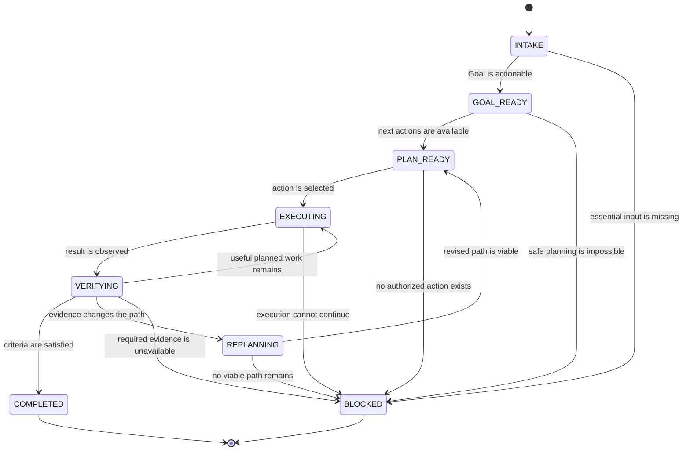

# Conceptual Lifecycle

LoopPilot uses eight conceptual states to explain its execution discipline. They are
not a required state-machine API, storage schema, enum, or host integration contract.
A host may represent equivalent behavior through context, a Plan, task status, tool
results, or no explicit state labels.

The four stop reports are outcomes, not additional required lifecycle states:
**Completed**, **Partially Completed**, **Blocked**, and **Budget Stop**. A host may
persist them if it already supports outcome status, but LoopPilot does not require
that representation.

## Transition Overview

Partially Completed may be reported when a run ends from an active state with useful
work and known gaps but no stronger Blocked or Budget Stop reason. Budget Stop may
end a run from any active state when a resource or diminishing-return boundary is
reached. These report rules do not require new host states or transitions.

## INTAKE

**Entry condition:** Receive a new request, a resumed task, or a user interruption
that may change the active Goal.

**Core behavior:** Read the latest instruction, supplied context, available evidence,
authority, and native state. Identify the objective, deliverables, constraints,
success criteria, and possible blockers. Do not ask for information already present.

**Exit condition:** Move to GOAL_READY when the Goal is actionable. Move to BLOCKED
only when essential input or authorization is missing and no safe reasonable
assumption permits progress.

## GOAL_READY

**Entry condition:** The objective, required outputs, constraints, and success
criteria are clear enough to guide action.

**Core behavior:** Reconcile the Goal with any host-native Goal, Plan, Todo, Memory,
or task status. Preserve user constraints and record only assumptions that affect
execution or verification.

**Exit condition:** Move to PLAN_READY when at least one concrete verifiable action
is identified. Move to BLOCKED if no safe action can be planned.

## PLAN_READY

**Entry condition:** A minimal Plan exists in the host's native representation, and
the next action is tied to a success criterion or evidence need.

**Core behavior:** Select the highest-value unblocked action. Confirm that it is
within scope, authorized, non-duplicative, and capable of producing progress,
evidence, a blocker, or a justified Plan change.

**Exit condition:** Move to EXECUTING when the action is selected. Move to BLOCKED
when every useful action requires a missing prerequisite. End with Budget Stop when
the cost boundary, rather than a missing prerequisite, prevents further work.

## EXECUTING

**Entry condition:** A safe, scoped, and verifiable action has been selected.

**Core behavior:** Use only capabilities the host actually exposes. Observe the real
result, errors, and side effects. Do not infer success from intent, simulate tool
evidence, or repeat an unchanged failed action.

**Exit condition:** Move to VERIFYING after observing a result. Move to BLOCKED when
execution cannot proceed without a missing prerequisite. Stop with the appropriate
report when no useful safe action remains.

## VERIFYING

**Entry condition:** An execution result or candidate deliverable is available for
comparison with a specific success criterion.

**Core behavior:** Gather task-appropriate evidence and check for regressions,
omissions, conflicting facts, or verification gaps. Distinguish direct observations,
attributed evidence, simulated traces, and recommended checks.

**Exit condition:** Move to COMPLETED only when the full Goal is supported. Return to
EXECUTING when another useful planned action remains. Move to REPLANNING when
evidence changes the best path. Move to BLOCKED when a missing capability prevents
required verification. Report Partially Completed when useful work remains
unverified or unfinished and the run otherwise ends.

## REPLANNING

**Entry condition:** An actual failure, disproved assumption, new constraint, user
instruction, lower-cost path, blocker, omission, or regression makes the current
Plan unsuitable.

**Core behavior:** Classify the event as recoverable, blocked, infeasible, or
budget-limited. Update the existing native Plan instead of creating a parallel one.
Choose a materially different approach when retrying. Do not replan merely to appear
reflective.

**Exit condition:** Move to PLAN_READY when a viable revised path exists. Move to
BLOCKED when a missing prerequisite prevents progress. End with Budget Stop when
further expected value is too low.

## BLOCKED

**Entry condition:** Every useful next action requires missing permission,
credentials, essential input, an unavailable tool or environment, an unauthorized
external or destructive action, or an irreplaceable user decision.

**Core behavior:** Stop execution, preserve completed work and evidence, and report
the exact blocker, incomplete criteria, attempted materially different approaches,
and smallest unblocker. Do not continue reflection or unrelated retries.

**Exit condition:** End the current run with a Blocked report. A later user message
or environment change may begin a new INTAKE; Blocked is never Completed.

## COMPLETED

**Entry condition:** All required deliverables exist, all success criteria have
actual evidence or an explicit user waiver, and no known critical regression or
omission remains.

**Core behavior:** Report the full outcome, observed verification, assumptions, and
any non-critical limitations. Distinguish checks actually run from checks merely
recommended.

**Exit condition:** End the current run with a Completed report. New work begins with
INTAKE; completion does not authorize unrelated follow-up actions.
