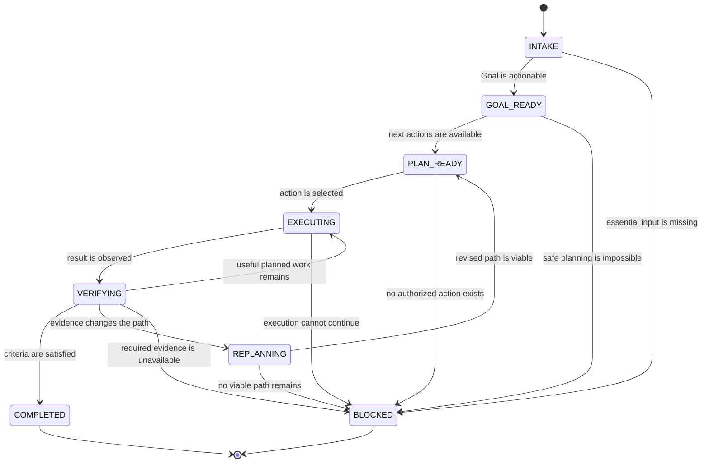

# Conceptual Lifecycle

LoopPilot uses eight conceptual states to explain its execution discipline. They are
not a required state-machine API, storage schema, enum, or host integration contract.
A host may represent equivalent behavior through context, a Plan, task status, tool
results, or no explicit state labels.

The four stop reports are outcomes, not additional required lifecycle states:
**Completed**, **Partially Completed**, **Blocked**, and **Budget Stop**. A host may
persist them if it already supports outcome status, but LoopPilot does not require
that representation.

Shared-state persistence is not a ninth lifecycle state or a fixed step after every
iteration. When cross-Agent or cross-session continuity is useful, an Agent MAY
update `.looppilot/` after a material event such as verified progress, a blocker, a
stable decision, an interruption, or a completion change. Routine iterations SHOULD
remain in host-native state, and simple tasks SHOULD NOT persist shared state.

## Optional Delegation Branch

Supervised delegation is an optional branch inside PLAN_READY and EXECUTING, not a
ninth lifecycle state or a mandatory step. When the host supports assignment and
the benefit is clear, the Supervisor MAY create scoped Task Contracts, collect
Worker submissions, obtain independent Review, and integrate approved work.

The parent run remains in the same conceptual lifecycle. Worker completion does not
move the parent Goal to COMPLETED. Reviewed work returns to VERIFYING only after an
Integrator combines it and runs parent-level checks. Conflicts, invalid authority,
failed review, or changed user instructions may return the run to EXECUTING or
REPLANNING, or lead to an honest stop.

Research, Skill routing, and a parent Checklist are conditional parts of this
branch, not mandatory lifecycle states. Before assignment, the Supervisor prepares
a Research Brief only when current external facts matter and inspects only Skills
the host confirms are available. Complex delegated Goals may use a Checklist as a
stable recovery index; simple tasks do not.

When context pressure becomes high or critical, the parent run preserves observed
evidence and one exact Resume Point, then may end with Budget Stop. Resumption starts
at INTAKE: current instructions, native state, files, Git, Checklist, contracts, and
handoff are revalidated before execution continues.

See [supervised multi-Agent coordination](multi-agent-coordination.md).

## Transition Overview

Partially Completed may be reported when a run ends from an active state with useful
work and known gaps but no stronger Blocked or Budget Stop reason. Budget Stop may
end a run from any active state when a resource or diminishing-return boundary is
reached. These report rules do not require new host states or transitions.

## Loop Engineering Barriers

For Full Loop delivery, the conceptual lifecycle is refined by Contract,
Implementation, Integration, Review, and Closure Barriers. These are evidence
boundaries rather than host scheduler states. Functional, Engineering, and Delivery
Acceptance all precede Loop closure.

A Task-level Readiness Check only permits a Worker Delivery to enter integration.
Final review examines the unified result after the Integration Barrier. See the
[Loop Engineering model](loop-engineering-model.md) for barrier criteria and
[protocol modes](protocol-modes-and-state-sources.md) for state ownership.
## INTAKE

**Entry condition:** Receive a new request, a resumed task, or a user interruption
that may change the active Goal.

**Core behavior:** Read the latest instruction, supplied context, available evidence,
authority, and native state. Identify the objective, deliverables, constraints,
success criteria, and possible blockers. The agent MUST NOT ask for information already present.

**Exit condition:** Move to GOAL_READY when the Goal is actionable. Move to BLOCKED
only when essential input or authorization is missing and no safe reasonable
assumption permits progress.

## GOAL_READY

**Entry condition:** The objective, required outputs, constraints, and success
criteria are clear enough to guide action.

**Core behavior:** Reconcile the Goal with any host-native Goal, Plan, Todo, Memory,
or task status. Preserve user constraints and record only assumptions that affect
execution or verification.

**Exit condition:** Move to PLAN_READY when at least one concrete verifiable action
is identified. Move to BLOCKED if no safe action can be planned.

## PLAN_READY

**Entry condition:** A minimal Plan exists in the host's native representation, and
the next action is tied to a success criterion or evidence need.

**Core behavior:** Select the highest-value unblocked action. Confirm that it is
within scope, authorized, non-duplicative, and capable of producing progress,
evidence, a blocker, or a justified Plan change.

**Exit condition:** Move to EXECUTING when the action is selected. Move to BLOCKED
when every useful action requires a missing prerequisite. End with Budget Stop when
the cost boundary, rather than a missing prerequisite, prevents further work.

## EXECUTING

**Entry condition:** A safe, scoped, and verifiable action has been selected.

**Core behavior:** Use only capabilities the host actually exposes. Observe the real
result, errors, and side effects. The agent MUST NOT infer success from intent or
simulate tool evidence. Apply the unchanged-failure invariant in `SKILL.md` before retrying.

**Exit condition:** Move to VERIFYING after observing a result. Move to BLOCKED when
execution cannot proceed without a missing prerequisite. Stop with the appropriate
report when no useful safe action remains.

## VERIFYING

**Entry condition:** An execution result or candidate deliverable is available for
comparison with a specific success criterion.

**Core behavior:** Gather task-appropriate evidence and check for regressions,
omissions, conflicting facts, or verification gaps. Distinguish direct observations,
attributed evidence, simulated traces, and recommended checks.

**Exit condition:** Move to COMPLETED only when the full Goal is supported. Return to
EXECUTING when another useful planned action remains. Move to REPLANNING when
evidence changes the best path. Move to BLOCKED when a missing capability prevents
required verification. Report Partially Completed when useful work remains
unverified or unfinished and the run otherwise ends.

## REPLANNING

**Entry condition:** An actual failure, disproved assumption, new constraint, user
instruction, lower-cost path, blocker, omission, or regression makes the current
Plan unsuitable.

**Core behavior:** Classify the event as recoverable, blocked, infeasible, or
budget-limited. Update the existing native Plan instead of creating a parallel one.
Choose a materially different approach when retrying. The agent MUST NOT replan
merely to appear reflective.

**Exit condition:** Move to PLAN_READY when a viable revised path exists. Move to
BLOCKED when a missing prerequisite prevents progress. End with Budget Stop when
further expected value is too low.

## BLOCKED

**Entry condition:** Every useful next action requires missing permission,
credentials, essential input, an unavailable tool or environment, an unauthorized
external or destructive action, or an irreplaceable user decision.

**Core behavior:** Stop execution, preserve completed work and evidence, and report
the exact blocker, incomplete criteria, attempted materially different approaches,
and smallest unblocker. The agent MUST NOT continue reflection or unrelated retries.

**Exit condition:** End the current run with a Blocked report. A later user message
or environment change may begin a new INTAKE; Blocked is never Completed.

## COMPLETED

**Entry condition:** All required deliverables exist, all success criteria have
actual evidence or an explicit user waiver, and no known critical regression or
omission remains.

**Core behavior:** Report the full outcome, observed verification, assumptions, and
any non-critical limitations. Distinguish checks actually run from checks merely
recommended.

**Exit condition:** End the current run with a Completed report. New work begins with
INTAKE; completion does not authorize unrelated follow-up actions.

## Full Loop Status Projections

Phase 2 adds semantic projections around the existing lifecycle. The Supervisor
approves a Loop Contract and decides business transitions; the Integrator records
Loop status in the Loop Map, Task status in the Task Ledger, and Finding status in
the Finding Ledger. Workers and Reviewers supply Deliveries, evidence, and decisions
without editing authoritative status.

Task `approved` means ready for integration, and Task `integrated` means included
in the unified result. Neither state advances Loop completion. The Loop remains
unchecked through review, acceptance, commit, and checkpoint states until the
Closure Barrier passes and the Loop Map records `closed`.

Phase 3 fills in the evidence path: Worker Delivery, Task-level Readiness,
Integration Record, integrated-outcome Review, Finding and scoped Rework,
reverification, three-layer Acceptance, and Loop Closure. Detailed artifacts do not
own status. A Closure decision of `accepted` still requires the Integrator to record
the separately supported `closed` transition in `LOOP-MAP.md`.

Phase 4 adds a recovery overlay without changing Loop status ownership. At high
pressure the Supervisor stops low-value work and stabilizes a Minimal Safe Unit. At
critical pressure it stops new execution after the Integrator records authoritative
state and a `budget-stopped` Checkpoint with one exact Resume Point. The existing
Loop `budget-exhausted` state remains the Loop Map projection when budget prevents
execution; it is not duplicated by the Checkpoint's more precise recovery status.

A resumed Supervisor enters validation before execution: reconcile the latest user
instruction, observed Git and working tree, Map and Ledgers, referenced artifacts,
capabilities, evidence, and authority. The decision is resume, corrected resume,
replan, block, invalidate, or cancel. No lifecycle label implies an automatic
session transition or runtime operation.

## Project Closure Gate

After mandatory Loops are authoritatively closed, Phase 5 adds a Project-level Gate
for Cross-Loop Validation, Project Spec and Standards Review, all three acceptance
layers, Finding disposition, release obligations, Final Checkpoint, Final Delivery
Report, and an authorized `PROJECT.md` projection. This is not a lifecycle state
engine or a sixth Loop Barrier. Accepted, closed, release-ready, authorized,
released, deployed, and acknowledged remain distinct facts. See the
[Phase 5 protocol](project-closure-and-final-delivery.md).
