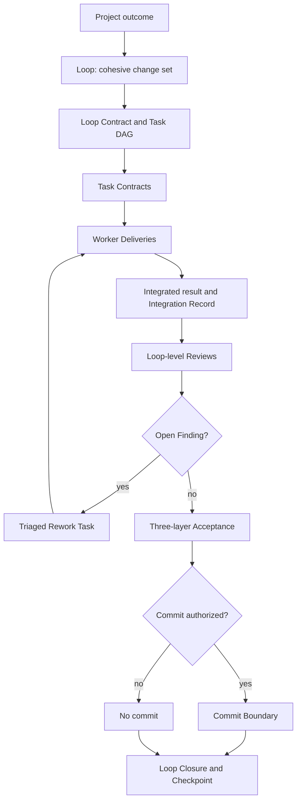
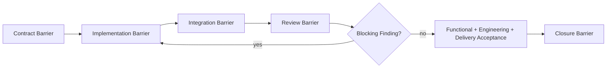

# Loop Engineering Model

LoopPilot treats software delivery as bounded engineering change, not as a fixed
number of Agent retries. This document defines the first-stage architecture. It does
not implement a scheduler, a workflow runtime, automatic commits, or real-host
compatibility.

## Loop Definition

A Loop is a cohesive change set that can be independently implemented, integrated,
reviewed, accepted, committed when authorized, and resumed from persisted state.

A Loop is not a feature label, one Worker Task, a fixed retry count, one Agent
conversation, an unbounded project phase, a Git commit, or a Checklist. A Loop MUST
map its deliverables to explicit user or system outcomes.

Before approving a Loop boundary, the Supervisor considers business cohesion,
overlapping change scope, dependencies, reusable context, interface and data
contracts, integration conflicts, acceptance criteria, security, operations, data
risk, available context, and whether an independent Checkpoint is possible. A Loop
that cannot be independently accepted, committed when authorized, or resumed SHOULD
be split, combined with a dependent Loop, or given a stronger persisted boundary.

## Object Model

A **Project** is the complete user outcome to be delivered. It contains Project
Scope, Engineering Context, an Architecture Profile, a Loop Map, architecture
decisions, Project Acceptance, and one or more Loops.

A **Loop** is the independently deliverable change set. It owns a Loop Contract,
Task DAG, integration facts, reviews, Findings, acceptance, closure, and recovery
boundary.

A **Task** is one Worker's authorized execution unit. It is not the parent
acceptance unit. A **Worker Delivery** contains that Task's result and observed
evidence. A **Rework Task** is scoped corrective work created from a triaged
Finding.

A **Review Report** is a Reviewer's independent judgment over the integrated result
or an explicitly bounded review scope. A **Finding** is a review issue that MUST be
triaged and closed, deferred, or risk-accepted by the authorized role.

An **Integration Record** captures actual merge, conflict-resolution, build, and
test facts. A **Loop Closure** captures deliverables, acceptance, remaining risk,
and the final Loop result. A **Checkpoint** is the current recovery entry before a
session change, compaction, or context limit. A **Commit Boundary** is the Loop's
authorized Git fact boundary; it is not a substitute for Closure or Checkpoint
state.

## Role Boundaries

**Supervisor owns scope, decomposition, engineering judgment, and acceptance
decisions.** The Supervisor understands the user problem, establishes Project
Scope and Engineering Context, identifies invariants, selects the protocol mode,
defines Loops and contracts, assigns roles, chooses the Reviewer Matrix, triages
Findings, accepts risk when authorized, and decides whether a Loop MAY close. The
Supervisor SHOULD avoid large implementation assignments when separation is useful.

**Worker owns implementation within the Task Contract.** A Worker implements,
self-tests, supplies a Delivery, reports blockers, requests scope changes, and
performs assigned rework. A Worker MUST NOT change Project or Loop scope, edit
authoritative Ledgers, alter another Worker's Task, hide failures, announce parent
acceptance, or create a final Loop commit without authorization.

**Reviewer owns independent judgment.** A Reviewer examines the integrated result,
performs Spec and Standards review plus assigned risk review, creates Findings, and
supplies evidence and verification methods. A Reviewer MUST NOT change scope or
business code, accept risk, close Findings directly, or treat approval as commit,
push, release, or deployment authority.

**Integrator owns facts, state transitions, integration, and recovery records.**
The Integrator collects Deliveries, performs the actual integration, resolves only
mechanical conflicts, runs integration checks, records facts and Findings, updates
authoritative state, writes Closure and Checkpoint artifacts, and creates a commit
only when authorized. The Integrator MUST escalate semantic conflicts and MUST NOT
change scope, reject Findings, accept risk, or infer external authority.

In short: the Supervisor decides; the Integrator records and executes authorized
transitions.

## Review Model

Spec Review and Standards Review are permanent axes. Spec Review checks the user
problem, use cases, business rules, transitions, failures, data and permission
behavior, acceptance criteria, and omissions. Standards Review checks architecture,
pattern fitness, duplication, test quality, error handling, security, operations,
compatibility, platform neutrality, and maintainability.

Risk specialists are selected from the
[Engineering Concern Matrix](project-engineering-context.md). Domain, Data,
Concurrency, Security, Operations, Performance, Architecture, Frontend, and
Compatibility Reviewers are enabled only when relevant. Their Findings feed the
appropriate permanent axis; they do not replace either axis.

A Task-level Readiness Check asks whether a Delivery stayed in scope, contains its
required evidence, has no obvious blocker, and can enter integration. It is not
final approval. Loop-level review happens after the integrated result crosses the
Integration Barrier.

## Barriers

The **Contract Barrier** requires approved Loop scope, stable key interface and data
contracts, a Task DAG, assigned Workers and Reviewers, and explicit acceptance
criteria. Dependent parallel work MUST NOT start against unstable contracts.

The **Implementation Barrier** requires every mandatory Worker to submit a
well-formed Delivery.

The **Integration Barrier** requires merged Worker results, resolved mechanical
conflicts, a passing build, passing basic integration tests, and an Integration
Record.

The **Review Barrier** requires every mandatory Reviewer decision, registered
Findings, identified BLOCKERs, and explicit rework state.

The **Closure Barrier** requires completed mandatory Tasks, integrated results, zero
BLOCKERs, dispositioned MAJOR Findings, Supervisor acceptance, updated Ledgers,
Loop Closure, an authorized commit when required, a Checkpoint, the next Loop input,
and a recoverable workspace. Process context MUST NOT be discarded before this
barrier passes.

## Three-Layer Acceptance

**Functional Acceptance** confirms that the user problem is solved, business rules
are correct, and positive and exceptional paths are covered.

**Engineering Acceptance** confirms data, concurrency, permissions, security,
observability, operations, architecture, tests, quality, compatibility, and
evolution needs.

**Delivery Acceptance** confirms deployment readiness, an applicable gray-release
decision, rollback or compensation, recoverable Checkpoint state, and a coherent
commit and documentation boundary.

Functional correctness alone cannot pass final review when the result is unsafe,
operationally unrecoverable, or incompatible with required evolution. All three
layers MUST pass before final Loop closure.

## Commit and Recovery

A commit is created only under current explicit authority and normally by the
Integrator. Commit permission does not imply push, release, or deployment
permission. The commit records code history; Loop Closure records the accepted
result and residual risk; Checkpoint records how to resume. Recovery uses persisted
state and observed repository facts, not a replay of the entire historical
conversation.

The target Full Loop artifacts are specified in
[protocol modes and state sources](protocol-modes-and-state-sources.md). Their
implementation is staged by the [migration plan](full-loop-migration-plan.md).

## Phase 2 Contracts and Ledgers

The static [Full Loop templates](../.looppilot/full-loop/README.md) now define a
Project Loop Map, one Contract per Loop, and authoritative Task and Finding Ledgers.
The Loop Map alone owns Loop status. Task and Finding detail remains separate from
Ledger status, and only a `closed` Loop may be checked complete. Task completion,
integration, Review approval, or commit alone does not pass the Closure Barrier.

The [Phase 2 protocol](full-loop-contracts-and-ledgers.md) defines enums, grouping,
Task DAG, Reviewer Matrix, budget, commit authorization exceptions, role decisions,
and Integrator recording. It is static structure, not an executing state machine.
