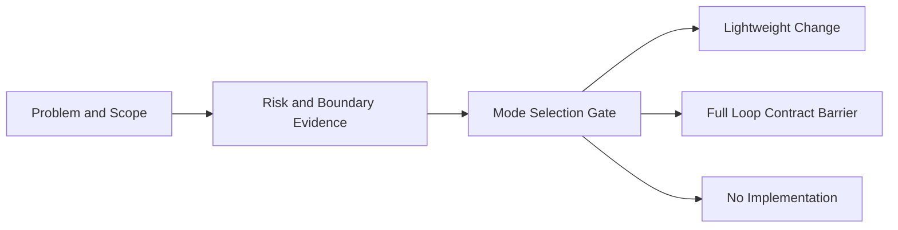
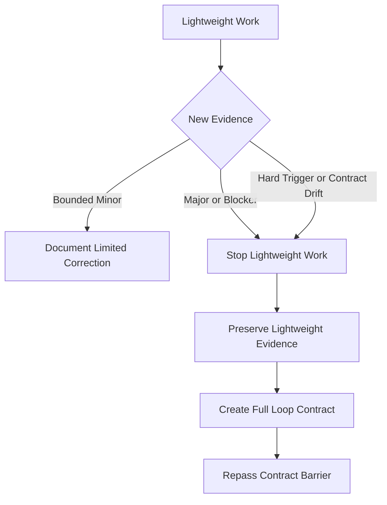
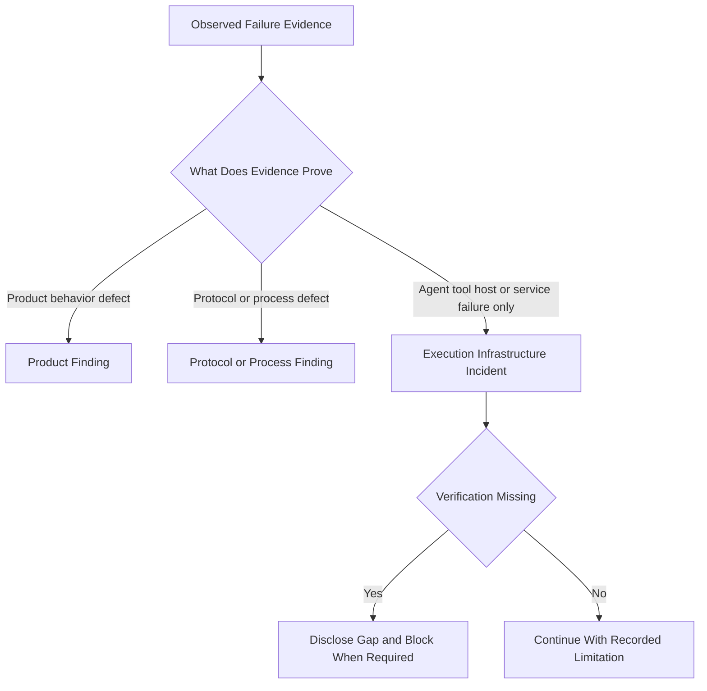

# Mode Selection and Escalation

## Authority and Timing

The Supervisor decides the mode. The Integrator records that decision. Mode
Selection does not own Project Status or Loop Status and does not change the
authority of PROJECT.md or LOOP-MAP.md.

Mode is selected before implementation in this order:

No Implementation is correct when investigation finds no real gap. An Agent must
not implement first and backfill a rationale later.

## Lightweight Tendency

Prefer Lightweight when most of these conditions hold:

- one verifiable change and one responsible owner;
- one language or a local module, with no cross-runtime contract;
- no SQLite, transaction, migration, data-consistency, sensitive-data, API-key,
  permission, security-boundary, or network-trust change;
- no partial-success, duplicate-mutation, corruption, or unrecoverable-state
  risk;
- no useful need for multiple Workers, independent integration proof, or a
  Security, Data, or Operations Reviewer;
- completion is realistic in one session with direct characterization tests;
- the change affects a small cohesive product surface;
- rollback is ordinary code reversion; and
- a short Change Contract can honestly express the scope.

One to four main product files is common supporting evidence, but file count is
supporting evidence, not the decision authority. A large file alone does not
justify Full Loop.

## Full Loop Hard Triggers

Evaluate Full Loop first when any hard trigger is present:

- a cross-language or cross-runtime contract;
- sensitive data, API keys, permissions, network trust, or another security
  boundary;
- SQLite transaction behavior, migration, partial success, corruption,
  duplicate writes, or unrecoverable state;
- multiple Workers with real parallel value, high-conflict files, or correctness
  demonstrable only after integration;
- a need for Security, Data, Compatibility, Operations, or another specialist
  Reviewer;
- active Checkpoint recovery or formal Finding, Rework, and reverification;
- scope too large for a stable short Change Contract;
- failure impact spanning domains or Loops; or
- a release-required or production-delivery obligation.

A hard trigger creates a Full Loop tendency, not an automatic runtime decision.
The Supervisor records actual evidence, grouping rationale, why Lightweight is
insufficient, and expected protocol cost before the Contract Barrier.

## Lightweight Escalation

Stop or escalate a Lightweight change when any of these occurs:

- a Major or Blocker Finding;
- scope expands into another language or runtime;
- SQLite, transaction, migration, sensitive-data, security, permission,
  partial-success, or duplicate-mutation impact appears;
- two or more Workers, an independent Integration Record, or a specialist
  Reviewer becomes necessary;
- the same problem needs more than one correction;
- context cannot safely complete in the current session;
- the artifact budget expands materially; or
- the original Change Contract no longer describes the work honestly.

Escalation records the reason, preserves existing evidence, and creates the
formal Full Loop Contract. Lightweight self-review does not become Full Loop
Review, and an earlier correction is not automatically relabeled as Rework.

## Lightweight Artifact Budget

The default target is four to seven protocol or experiment artifacts. This is a
Provisional Heuristic for cost control, not a hard limit, lifecycle state,
severity, Ledger, or acceptance rule. A Supervisor may retain Lightweight above
seven with a recorded explanation and mode reassessment; continued growth or
contract drift requires escalation.

A typical set contains State or Change Contract, Checklist, Review, Results or
Handoff, and only necessary recovery or test evidence. Lightweight does not
default to a Loop Map entry, full Loop Contract, Task Ledger, Finding Ledger,
multiple Worker Deliveries, Integration Record, Loop Closure, Project Closure,
Cross-Loop Validation, Project Acceptance, Release Readiness, or Final Delivery
Report.

## Product, Protocol, and Infrastructure Boundary

An Execution Infrastructure Incident is a recording classification for an Agent,
tool, host, dependency service, CI system, or packaging facility that did not
operate as expected without evidence of a product implementation defect. It is
not a new role, Finding status, severity, Ledger, or authority.

Examples include a Worker rate limit or 429, timeout, no output, host compaction,
dependency download outage, CI infrastructure failure, and local packaging-tool
failure. Record incidents in a Worker Delivery, Integration Record, Review
Report, Handoff, Results, or Checkpoint when they affect that artifact. Put an
incident in Checkpoint Must Load only when it affects recovery.

A Product Finding concerns implemented product behavior, such as incorrect data
semantics. A Protocol or Process Finding concerns violated governance, such as
an illegal Task status. Both may enter the existing Finding Ledger through the
existing authority. A 429 or timeout does not automatically become a Product
Finding, but a tool failure can reveal evidence that separately proves one.

No output must not be converted into a fabricated Worker Delivery. Missing
verification can block Review or Closure without proving product failure.

## Specialist Reviewers

Spec and Standards are permanent independent axes. Specialist Reviewers are
risk-loaded and do not replace those axes or create a new authority:

| Reviewer | Load when evidence includes |
| --- | --- |
| Security | API keys, SSRF, credentials, permissions, authentication, network trust, redirects, sensitive logs or data, import/export, hostile input, or Tauri capabilities |
| Data | SQLite, transactions, migrations, partial success, data preservation, rollback, foreign keys, concurrency, consistency, corruption, or durable mutations |
| Compatibility | TypeScript/Rust or Web/Tauri contracts, Provider DTOs, serialization, API/schema/version evolution, host boundaries, or backward compatibility |
| Operations | deployment, rollback, observability, runbooks, alerting, production delivery, or operational recovery |
| Accessibility | UI focus, keyboard use, screen readers, or mobile accessibility |

Full Loop does not automatically load every specialist. A Reviewer may cite an
Execution Infrastructure Incident as evidence, but must not turn it into a
Finding without product or protocol proof. Reviewers do not modify the
implementation under review.

## Architecture Selection

OOP, DDD, DI, MVVM, and zero-copy are evidence-selected options. Choose them
only when domain invariants, ownership, test seams, view/application coupling,
allocation measurements, or benchmarks justify the added structure. Do not
force DDD into every Full Loop, add a large DI framework by default, forward
state through MVVM without a real view boundary, make a class for a pure helper,
or claim zero-copy value without measurement.

## Decision Record

The Project Template and Loop Contract record candidate mode, observed evidence,
hard triggers, expected artifact budget, escalation conditions, Supervisor
decision, Integrator record, active specialist Reviewers, rejected Lightweight
rationale when Full Loop is selected, and recovery implications. These fields
describe a decision; they do not add a status or Ledger.
