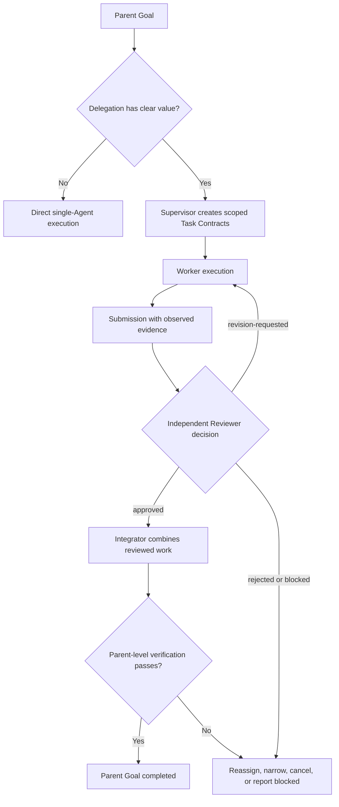

# Supervised Multi-Agent Coordination

## Positioning

LoopPilot defines an optional, host-native delegation and supervision protocol for
hosts that support multiple Agents, delegated sessions, or equivalent task
assignment. It specifies behavior, Task Contracts, logical roles, shared summaries,
review decisions, revision rules, conflict handling, and integration
accountability.

LoopPilot does not provide an Agent runtime, scheduler, automatic child-Agent
launcher, process or filesystem isolation, distributed locks, cancellation service,
database, backend, Web UI, MCP Server, or automatic merge engine. Creation,
scheduling, parallel execution, cancellation, result recovery, and runtime
permission isolation remain host capabilities.

The protocol is optional even on a capable host. Simple tasks MUST NOT be split
across multiple Agents without a clear, documented benefit.

## Roles and Final Accountability

### Supervisor

The Supervisor remains accountable for the parent Goal. It reads the latest user
instruction and native Plan, decides whether delegation is useful, decomposes work,
checks dependencies and overlap, creates Task Contracts, assigns Workers, chooses
sequence or parallelism, tracks state, checks scope, sends submissions to review,
handles corrections or reassignment, and coordinates integration.

The Supervisor MUST NOT approve from Worker self-report alone, treat every approved
subtask as parent completion, silently merge conflicts, expand user authority, or
retain delegation when its coordination cost exceeds its value.

### Worker

A Worker performs only the assigned Task Contract. It re-checks dependencies and
current facts, remains within allowed scope, avoids forbidden scope, produces
specific deliverables, gathers observed evidence, reports blockers and risks, and
submits work for independent review.

A Worker MUST NOT change the parent Goal, grant itself authority, inherit another
Agent's authority, resolve cross-task conflicts privately, mark work approved or
integrated, or announce parent completion.

### Reviewer

The Reviewer independently compares the submission with its Task Contract. Review
covers scope, deliverables, success criteria, required evidence, parent alignment,
regression risk, conflict safety, and authority compliance. The only decisions are
`approved`, `revision-requested`, `rejected`, and `blocked`.

A Reviewer MUST NOT issue a vague approval, accept Worker narration as verification,
hide unverified gaps, expand authority, or treat approval as commit, push, release,
deployment, deletion, or external-communication authorization.

### Integrator

The Integrator combines reviewed work and verifies the parent result. The
Supervisor MAY also serve as Integrator, but integration remains a distinct
responsibility. The Integrator checks overlapping files and interfaces, conflicting
rules, changed assumptions, combined regressions, and parent-level success criteria.

Multiple Agents MAY contribute, but one accountable Supervisor or Integrator MUST
own the final integrated result. If no final owner is identifiable, the parent Goal
MUST NOT be marked completed.

## Delegation Decision

Delegation can be valuable when the parent Goal contains independent deliverables,
non-overlapping modification scopes, clear input dependencies, explicit output
interfaces, separately checkable success criteria, a strong need for independent
review, or useful specialist perspectives.

Delegation is usually inappropriate for a one-step task, a small single-file edit,
highly coupled work, work that every participant must perform in the same core
region, work without independent acceptance criteria, or a host that cannot
reliably assign and recover results.

The Supervisor SHOULD compare parallel benefit with decomposition, communication,
review, revision, and integration cost. A direct single-Agent path is correct when
the coordination overhead is greater.

## Parallel Eligibility

Before assigning concurrent Workers, the Supervisor MUST check:

- overlapping files, modules, records, resources, or output regions;
- whether every input dependency is satisfied;
- whether output interfaces and ownership are explicit;
- whether shared state could be overwritten;
- whether each subtask can be independently accepted;
- whether one task can invalidate another task's assumptions;
- failure recovery and integration cost; and
- least-privilege authority for each assignment.

When multiple tasks concern the same core file, the preferred mode is parallel
suggestion-only work followed by a single Integrator edit. Concurrent direct writes
to the same core file SHOULD be avoided.

## Task Contract

Every delegated task MUST use a compact Task Contract based on
[`TASK-TEMPLATE.md`](../.looppilot/tasks/TASK-TEMPLATE.md). The contract records:

- stable `task_id` and immutable `parent_goal`;
- current and previous status plus the logical role that changed it;
- assigned role and platform-neutral assignee;
- one bounded objective;
- allowed and forbidden scope;
- concrete deliverables;
- observable success criteria;
- required evidence;
- dependencies;
- explicit action-by-action authority;
- Reviewer and integration owner;
- revision count and a positive task-specific revision limit; and
- creation and update dates.

The contract is authoritative for scoped responsibility, not for the parent Goal or
for authority beyond the latest user instruction. It does not store a complete
conversation, private chain-of-thought, or a duplicate native Plan.

High-impact authority defaults to false. `commit`, `push`, `release`, `deploy`,
`delete`, and `external_communication` remain separate decisions.

## Task Lifecycle

The detailed transition table is in the
[task protocol](../.looppilot/tasks/README.md). The main supervised path is:

`approved` means a subtask passed review. `integrated` means the reviewed result was
incorporated into the parent result and passed integration checks. These statuses
MUST NOT be merged. A Worker may advance work to `in-progress`, `submitted`, or
`blocked`; a Reviewer controls review decisions; only a Supervisor or Integrator
may mark a task `integrated`.

Cancelled and integrated tasks are terminal. A correction to integrated work
requires a new task. If the user changes the parent Goal, the Supervisor MUST pause,
cancel, or rewrite invalid Task Contracts before execution continues.

## Review and Revision

The [review template](../.looppilot/tasks/REVIEW-TEMPLATE.md) requires a decision,
criteria checked, findings, required corrections, remaining gaps, and an authority
note.

An approval MUST cite checked success criteria and observed evidence. A revision
request MUST identify the failed criterion, missing evidence, scope violation,
conflict, and expected change. A blocked result MUST identify the missing input,
permission, tool, or environment. A rejection MUST explain why the current result
should not proceed to another ordinary revision or integration.

Revision keeps the original Task ID, increments `revision_count`, and returns to
`in-progress`. Before assignment, the Supervisor SHOULD choose a positive,
task-specific revision limit appropriate to task risk and cost.
The Review Result remains attached during a legal correction or rejected-task
restart until a later review supersedes it. Advancing status MUST NOT discard the
recorded criteria, evidence gap, correction, or rejection reason.
The count MUST NOT exceed that limit; budget exhaustion requires a different
strategy, a user decision, or an honest stop.

Repeated failure requires a materially different strategy. The Supervisor MUST
change the method, narrow scope, change the Worker, request a user decision, or stop
as blocked or budget-stopped. Reissuing the same failed instruction to the same
Worker without changed evidence or strategy is not progress.

## Conflict Detection and Resolution

Before integration, the Supervisor and Integrator MUST inspect:

- same-file and same-region changes;
- contradictory specifications or decisions;
- duplicate implementations;
- unmet dependencies;
- changes that invalidate another task's assumptions;
- allowed- or forbidden-scope violations;
- stale shared state;
- authority inherited from another Agent; and
- incompatible output formats.

Conflict resolution MUST NOT use last-writer-wins, silent overwrite, random
selection, or Worker confidence. The responsible role marks the conflict, preserves
observable evidence from each side, pauses affected integration, resolves through
the Supervisor, Reviewer, a dedicated integration task, or the user, and re-runs
combined verification.

Stable conflict decisions MAY be summarized in
[`DECISIONS.md`](../.looppilot/DECISIONS.md). Routine review results remain with the
Task Contract and review artifact.

## Authority Continuity

Delegation transfers responsibility for scoped work, not authority beyond the
explicit Task Contract and current user instruction.

Supervisor commit authority does not grant a Worker commit or push authority.
Assignment to modify files does not imply deletion. Reviewer approval does not
authorize commit or publication. Integration responsibility does not authorize
release or deployment. Old authority recorded under `.looppilot/` is historical
context and MUST be re-confirmed against current instructions.

The protocol can describe least privilege, but it cannot create runtime isolation
that the host lacks.

## Shared State and Handoff

[`DELEGATION.md`](../.looppilot/DELEGATION.md) is a compact parent-level
coordination summary. It does not copy each Task Contract or the native Plan. Each
task file stores one bounded contract.

[`HANDOFF.md`](../.looppilot/HANDOFF.md) is sequential continuity between Agents or
sessions. Delegation is concurrent or sequential assignment under one parent Goal.
A handoff is not a Task Contract, does not assign Supervisor or Worker status, and
does not transfer authority.

All shared state can become stale. A resuming Agent MUST compare it with the latest
user instruction, native state, actual sessions, files, tools, tests, and
authorization before continuing.

## Integration and Parent Verification

Approval is necessary but insufficient for parent completion. The Integrator MUST
verify that reviewed outputs coexist, interfaces align, conflicts are resolved,
combined regressions pass, and the parent success criteria have observed evidence.

The parent Goal may be completed only when all required deliverables are integrated,
parent-level checks pass, no critical conflict remains, and one accountable final
owner accepts the result. Otherwise the correct outcome is partially completed,
blocked, cancelled, or budget-stopped.

## Stop Conditions

Delegation SHOULD stop or contract when:

- the user cancels or materially changes the parent Goal;
- a required permission, input, tool, or environment is missing;
- repeated revisions yield no progress under the current strategy;
- conflict cannot be resolved without a user decision;
- the responsible Integrator is unavailable;
- the host cannot reliably recover delegated results;
- coordination cost now exceeds remaining benefit; or
- a bounded revision or resource budget is reached.

Stopping preserves useful reviewed work and reports exact gaps. It does not convert
partial or approved work into parent completion.

## Host Capability Limits

A host may provide none, some, or all of: sequential assignment, independent
review sessions, parallel Workers, task cancellation, resumable sessions, and
runtime permission isolation. LoopPilot adapts only to capabilities actually
observed.

The repository's static checks verify document structure, enums, transitions,
authority fields, links, and diagram syntax. They do not prove real multi-Agent
creation, scheduling, Reviewer independence, concurrent isolation, cancellation,
cross-session recovery, automatic merging, or behavior on a named host.
