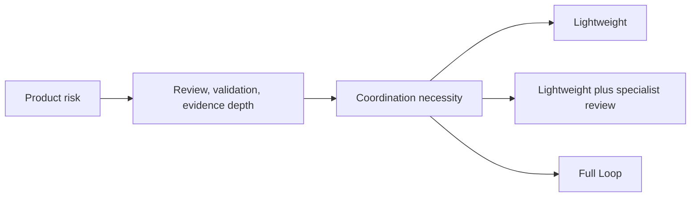

# Phase 9: Second Evidence-Backed Protocol Calibration

## Scope and Evidence Boundary

Phase 9 calibrates existing protocol guidance from MMGH EXP-001 through EXP-004,
Final-Assignment EXP-005, and committed EXP-006 arm evidence. It follows
`evidence -> contradiction -> bounded calibration`; it does not add a protocol
layer because an idea is plausible. See the
[Final-Assignment evidence](final-assignment-behavioral-evidence.md) for the
observed archive limitation.

Only Lightweight and Full Loop are modes. "Specialist-reviewed Lightweight" is a
Lightweight configuration, not a third mode.

## Calibration

1. Product Risk and Coordination Necessity are independent. Product risk sets review,
   validation, and evidence depth; coordination necessity decides whether Full Loop
   governance is warranted.
2. High product risk alone is not proof that multiple Workers are needed.
3. Lightweight may load risk-matched specialists while preserving Spec and
   Standards. A specialist does not automatically require Full Loop.
4. Multiple Workers are justified only when separate ownership, independent
   deliverables, meaningful integration, recovery, or rework needs create actual
   coordination benefit.
5. A delegated responsibility normally gets at most two unsuccessful attempts,
   then one fallback owner, ownership collapse, or a block decision.
6. Full Loop can retain its Ledgers, integration, review, closure, and authorities
   while implementation ownership collapses to one designated Worker.
7. Red baselines are recorded as Repository, Environment-Corrected, and
   Scope-Focused evidence rather than a new Ledger.
8. `test command passed` is limited to tests actually selected by that command.
9. Worker natural-language summaries update authoritative state only when a claim
   has verifiable evidence.
10. The Lightweight four-to-seven target counts Governance Artifacts, not
    Evaluation or Research Artifacts; all categories still report their cost.
11. Templates and default guidance use stack-neutral language. Specific runtime
    names remain examples when pedagogically useful.
12. EXP-005 and the committed EXP-006 arms support these bounded heuristics. Final
    EXP-006 score comparison and dynamic H-7 persistence remain unverified because
    the observed control archive is incomplete.

## Artifact Accounting

| Category | Includes | Lightweight target |
| --- | --- | --- |
| Product Artifacts | Source, tests, allowed schema, product configuration | Not counted as governance budget |
| Governance Artifacts | Contracts, Ledgers, Deliveries, Integration, Review, Closure, Checkpoint, Handoff | Four to seven heuristic |
| Evaluation / Research Artifacts | Plans, baselines, scorecards, manifests, comparative reports, observations | Not counted as governance budget |

Record product, governance, and evaluation artifact and line counts separately.
The target is a cost heuristic, not a state or hard maximum.

## Static Boundaries

Phase 9 adds no role, mode, Ledger, status, severity, Barrier, acceptance layer,
recovery authority, risk-scoring runtime, Reviewer runtime, Worker scheduler, Web
UI, or MCP orchestrator. Full Loop remains available for genuine coordination
needs; Lightweight remains the proportional default when one owner can safely
deliver and verify the bounded change.

## External Design Reference

The supplied Code Skill reference was classified as External Design Evidence for
progressive disclosure, metadata, reference/script separation, host-native loading,
and the boundary between scripts and model judgment. External reference
verification was unavailable in this calibration, so it creates no Normative rule
and no claim about the external source.

## Status

Phase 9 is a static protocol calibration. It does not claim host compatibility,
runtime orchestration, completed EXP-006 comparative validation, release, or
deployment.
