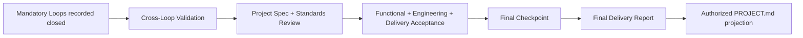
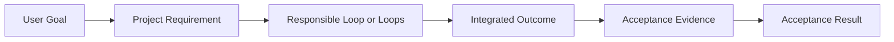
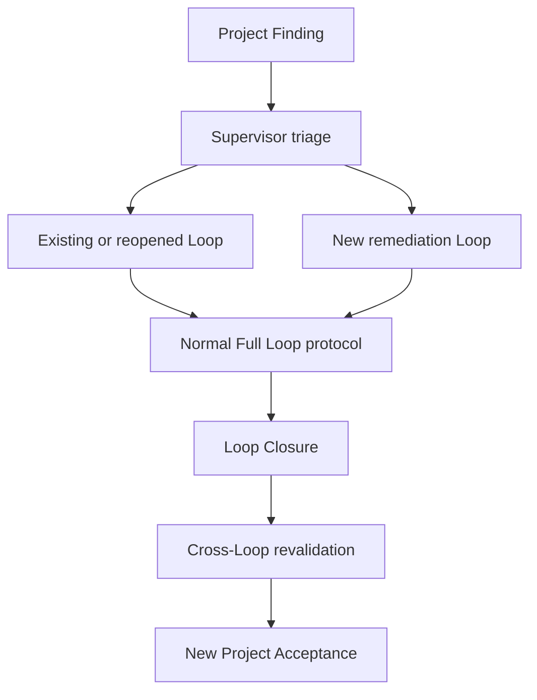
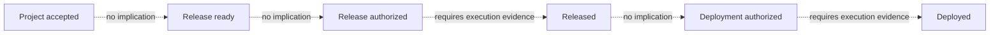
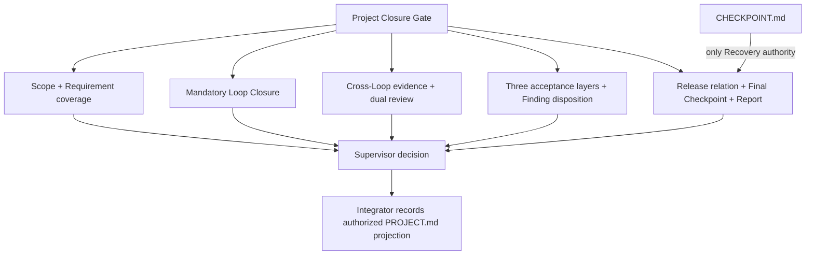

# Project Closure and Final Delivery

Phase 5 defines static Project-level contracts after mandatory Loops close. It does
not automate validation, status changes, Finding routing, release, deployment, or
report delivery. All behavior remains behaviorally unverified until Phase 6 records
real-host and real-project traces.

## Formal Definition

Project Closure is the evidence-backed decision that the complete Project outcome
satisfies the original user goals, cross-Loop behavior, project-level engineering
requirements, delivery requirements, and final recovery requirements.

Project Closure is not the sum of Loop states, a Project Acceptance document, a
Final Delivery Report, Release Readiness, release authorization, a tag, a release,
deployment, or user acknowledgement.

```text
All Loops closed
!= Project accepted
!= Project closed
!= Release ready
!= Release authorized
!= Released
!= Deployed
```

## Delivery Modes

### Delivery-only

A Delivery-only Project completes code or other deliverables, Project Acceptance,
the Final Checkpoint, and the Final Delivery Report. Release and deployment are
outside the authorized Scope. Release Readiness may be `not-applicable`, and the
absence of a release does not block Project Closure.

### Release-required

A Release-required Project Contract explicitly includes a tag, release, deployment,
or another named publishing action. That obligation is part of Project Delivery
Acceptance. Missing authority or execution keeps acceptance `blocked` until the
obligation is satisfied or the user explicitly changes Scope. Engineering
completion cannot erase the release obligation.

## State and Evidence Authorities

- `PROJECT.md` is the only authority for Project status.
- `LOOP-MAP.md` is the only authority for Loop status.
- `TASK-LEDGER.md` is the only authority for Task status.
- `FINDING-LEDGER.md` is the only authority for Finding status.
- `CHECKPOINT.md` is the only Recovery authority.

Cross-Loop Validation stores integrated evidence. Project Acceptance stores the
Supervisor's project-level decision and evidence. Release Readiness stores release
preparation evidence. The Final Delivery Report gives a user-readable summary.
None of these detailed artifacts owns authoritative status.

The responsible role supplies a decision and evidence. The Integrator verifies that
the transition is recordable and updates the appropriate authoritative source. A
Reviewer judges independently but does not modify implementation or Project status.
A Worker corrects a Project Finding only through a scoped remediation Loop.

## Cross-Loop Validation

Cross-Loop Validation includes only mandatory Loops recorded `closed`, their Loop
Closure references, and their real commit or artifact boundaries. It examines
dependencies, end-to-end user flows, Requirement coverage, interfaces, data and
migration ordering, identity and permission composition, security, concurrency and
idempotency, configuration, observability, performance, deployment ordering,
rollback or compensation, version evolution, and documentation where relevant.

Its statuses are `inactive`, `planned`, `in-progress`, `passed`,
`passed-with-limitations`, `failed`, `blocked`, and `superseded`.
`passed-with-limitations` requires disclosed non-blocking limitations and cannot
hide a Project Blocker. Closed Loops alone never produce `passed`; evidence from
single-Loop tests alone is insufficient.



## Goal-to-Evidence Mapping

Project Acceptance traces each current user goal through a Project Requirement,
one or more responsible Loops, the integrated delivered outcome, acceptance
evidence, and a result.



The mapping exposes goals without Loops, Loops without user value, partial outcomes
without integrated evidence, stale Scope changes, cancelled or excluded work
counted as delivered, undisclosed deferred work, Worker-only evidence, and conflicts
between Loop Closure and Project Requirements. `REQ-001` is the default identifier;
an existing stable Project identifier remains valid.

## Project Review and Findings

Project-level Review uses the Phase 3 Review Report with `Review Level: project`, a
Project ID, `Loop ID: not-applicable`, the reviewed Cross-Loop Validation,
Goal-to-Evidence Mapping, and integrated boundary. Project Spec Review checks user
goals, current Scope, mandatory Loop coverage, flows, invariants, exceptions,
cancelled work, deferred work, evidence, and report accuracy. Project Standards
Review checks architecture, data, identity, security, concurrency, observability,
compatibility, operations, Release Readiness, and the Final Checkpoint.

Both mandatory axes must pass. Security, Operations, Data, Compatibility,
Architecture, Performance, Compliance, Accessibility, Factual Accuracy, Citation,
and Domain Expert Reviews contribute when risk requires them; they do not replace
the two axes.

Project Spec Review and Project Standards Review each require an independent,
evidence-backed result; one axis cannot offset the other.

A Project Finding is triaged by the Supervisor and routed to an existing, reopened,
or new remediation Loop. Its target Loop `FINDING-LEDGER.md` owns status. The
Project Acceptance keeps only the reference and Project impact; the protocol must
not create or maintain a Project Finding Ledger.



A Project Blocker prevents acceptance. A Major Finding must be closed, deferred, or
risk-accepted by an authorized role. The Integrator does not choose remediation or
accept risk; the Reviewer does not change implementation; the Worker cannot close
its own Finding. Superseded validation and acceptance evidence remains traceable.

## Project Acceptance

Project Acceptance statuses are `inactive`, `draft`, `under-review`, `accepted`,
`accepted-with-risks`, `blocked`, `rejected`, and `superseded`.
`accepted-with-risks` requires complete disclosure and an authorized non-Blocker
risk decision. It cannot bypass a mandatory Loop, either review axis, any acceptance
layer, a Project Blocker, or a Release-required obligation.

Project Functional Acceptance verifies the complete user outcome, end-to-end flows,
cross-Loop business rules, failure paths, compensation, and observable results.
Project Engineering Acceptance verifies global architecture, data evolution,
permission and security consistency, concurrency and idempotency, observability,
compatibility, and disclosed technical risk. Project Delivery Acceptance verifies
the delivery mode, configuration, handoff or deployment instructions, rollback or
compensation, Release Readiness, Final Checkpoint, Final Delivery Report, deferred
work, and accepted risks. All three must pass.

Project accepted is an evidence decision. Project closed is a later authoritative
status recorded only in `PROJECT.md`. Neither means that the user acknowledged the
delivery.

## Release Readiness and Authority

Release Readiness statuses are `inactive`, `not-applicable`, `in-progress`, `ready`,
`ready-with-accepted-risks`, `blocked`, `cancelled`, and `superseded`.
It checks candidate identity, artifacts, builds and tests, migration, configuration
and secrets, feature flags and gray release, operations and observability, security
and compliance, rollback and recovery, documentation, gaps, risks, and permissions.



Commit, push, tag, release, deploy, migrate, rollback, and traffic-change authority
are independent and current. Release Readiness never grants or executes any of
them. A ready but unauthorized release records `not-executed-not-authorized`.
Delivery-only work may close without release. Release-required work remains blocked
until its Contract is honestly satisfied.

## Final Checkpoint and Final Delivery Report

The Final Checkpoint records the final Project or artifact boundary, actual HEAD,
working tree, uncommitted changes, deferred work, accepted risks, report reference,
and real release and deployment state. It remains the single recovery authority.
For a closed Project the exact terminal boundary is:

```text
Resume item: PROJECT-CLOSED
Resume action: Validate a new explicit user instruction before reopening the Project or creating another Loop.
Required inputs: latest user instruction, PROJECT.md, LOOP-MAP.md, Final Delivery Report, Final Checkpoint.
Required tool or capability: repository and project-state access.
Expected observable result: either no action under the closed Scope or a new authorized Loop Contract.
Stop or escalation condition: any request that changes Scope, permissions, release state, or production behavior.
```

Final Delivery Report statuses are `inactive`, `draft`, `ready`, `issued`, and
`superseded`. `ready` means the report is complete for a recipient; `issued` requires
observed delivery to a real recipient. The report emphasizes original goals,
delivered outcomes, verification, artifacts, use, release and deployment facts,
configuration, operations, rollback, deferred work, accepted risks, known
limitations, exclusions, cancellations, recovery, and unverified items. It does not
copy complete Ledgers, Reviews, Worker Deliveries, chats, or hidden reasoning.

## Project Closure Gate

The Project Closure Gate requires all mandatory Loops closed, passed Cross-Loop
Validation, both Project review axes, all three Project Acceptance layers, zero
Project Blockers, authorized Major dispositions, disclosure of deferred work and
accepted risk, an honestly satisfied or inapplicable release requirement, a ready
or validated Final Checkpoint, a ready Final Delivery Report, and an authorized
`PROJECT.md` status projection.



The Project Closure Gate is not a sixth Loop Barrier; the five Loop Barriers remain
unchanged. It does not mutate status or repair findings. Failed project-level checks
route through a normal remediation Loop and then require revalidation.

## Static Boundary

This protocol does not automate Project Acceptance, Project Closure, mandatory Loop
judgment, Goal-to-Evidence Mapping, Requirement coverage, cross-Loop tests, Project
Finding creation or routing, remediation Loop creation, risk acceptance, version
selection, tags, releases, deployment, migration, rollback, gray traffic, report
delivery, or user acknowledgement. Static validation checks only required files,
structure, enums, identifiers, obvious contradictions, authority boundaries, and
truthfulness. Named-host compatibility, Reviewer independence, report usability,
real recovery, remote CI, and all Phase 6 behavior remain unverified.
