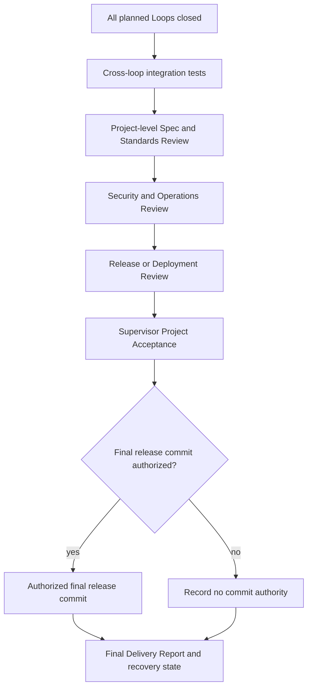

# Project Closure

Project Closure is the project-level acceptance protocol after every planned Loop
has reached its own Closure Barrier. This phase defines the target only; it does not
implement release automation, a closure engine, or a live Project Closure template.

## Target Flow

Closing every Loop is necessary but not sufficient to close the Project. Project
Acceptance considers cross-Loop regression, whole-project security, deployment
evidence, documentation completeness, mapping to user outcomes, API and data
compatibility, release readiness, and final recovery and delivery instructions.

A cross-Loop test failure reopens the relevant decision even when every individual
Loop previously passed. Release, deployment, tag creation, and final commit remain
separate authorities. Review approval does not grant any of them.

## Later Artifacts

A later phase may define a Project Closure template, final delivery report,
cross-Loop integration record, and release review contract. Those artifacts MUST
reference Loop Closures and observed facts rather than duplicating Loop status.
