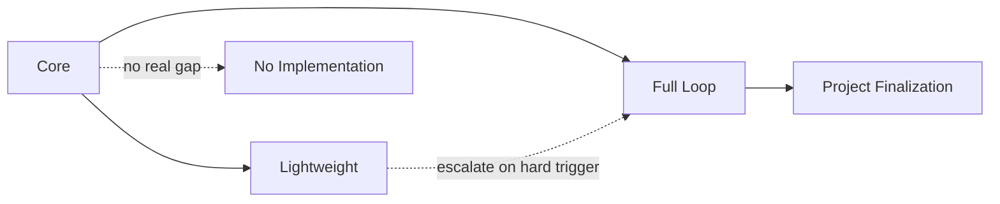

# Protocol Load Profiles

## Purpose

Load profiles minimize default context while preserving authority. They are
documentation guidance, not runtime modes, status, or automatic dispatch. Load
the smallest profile that represents the current work, then add only evidence
required by risk or recovery.

## Core Profile

Load for every task:

- applicable host and repository instructions;
- `SKILL.md` and the current user instruction;
- current Git and observable workspace state;
- the active host-native Goal and Plan, if any; and
- `.looppilot/STATE.md` and `.looppilot/HANDOFF.md` only when continuity is
  relevant.

Core does not itself create a Project, Loop, Task, Finding, or Checkpoint.

## Lightweight Profile

Load Core plus a short Change Contract or State entry, a compact Checklist when
needed, direct verification evidence, and a bounded Review or Results/Handoff.
Load Resume Validation only when recovery actually occurred.

The default target is four to seven protocol or experiment artifacts. This is a
Provisional Heuristic, not a hard limit or state. Explain and reassess work above
the target.

Lightweight does not default to Full Loop history, Loop Map entries, full Loop
Contracts, Task or Finding Ledgers, multiple Worker Deliveries, Integration
Records, Loop Closure, Project Closure, Cross-Loop Validation, Project
Acceptance, Release Readiness, or Final Delivery Reports.

## Full Loop Profile

Load Core plus the active Project engineering context, Loop Map entry, Loop
Contract, Task and Finding Ledgers, scoped Task Contracts, relevant Worker
Deliveries, Review Reports, Integration Record, Closure requirements, and the
current Checkpoint only when recovery is active.

Always retain independent Spec and Standards Review. Add Security, Data,
Compatibility, Operations, Accessibility, or another specialist only when the
Loop Contract identifies the corresponding risk. Full Loop does not load all
specialists by default.

## Project Finalization Profile

Load this profile only when multiple mandatory Loops, Project Acceptance,
release readiness, or final delivery actually requires project-level closure.
Load the Project Closure templates, Cross-Loop Validation, Project Finding
triage, independent Project Review, Project Acceptance, Release Readiness, and
Final Delivery Report as applicable.

A single Lightweight change or ordinary single-Loop delivery does not load this
profile. Release Readiness records evidence and never authorizes release,
deployment, migration, traffic change, or rollback.

## Recovery and Incidents

Checkpoint and Context Compaction describe the current mode only. Lightweight
recovery must not import Full Loop history merely because it exists. Add an
Execution Infrastructure Incident to Must Load only when it affects recovery,
verification required to resume, or the Exact Resume Point.
