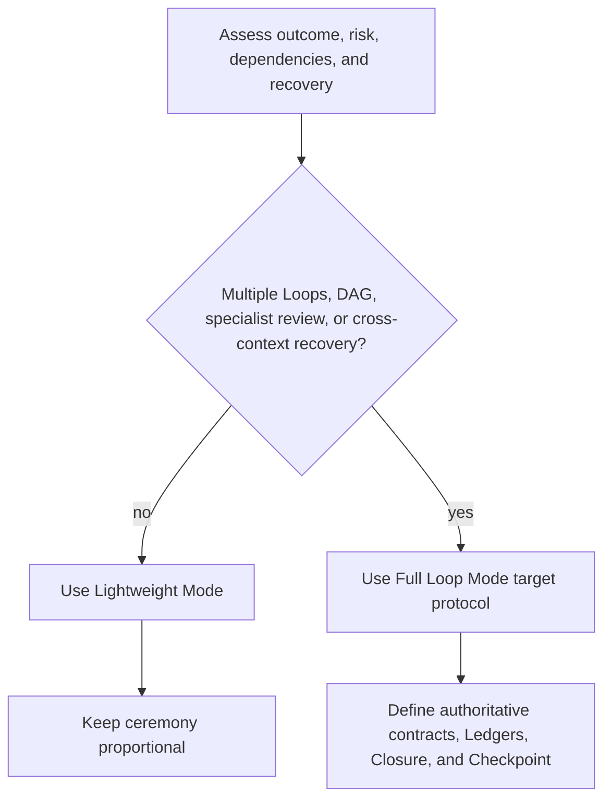

# Protocol Modes and State Sources

Process depth MUST be proportional to task complexity, risk, and recovery needs.
LoopPilot keeps the existing shared-state protocol as Lightweight Mode. Full Loop
Mode remains a staged target; Phase 2 now provides inactive Contracts and Ledger
templates without migrating active state, creating a fictional Loop, or implementing
a workflow runtime.

## Lightweight Mode

Lightweight Mode is appropriate for a simple task or one small Loop, a clear and
low-risk change, one or few Workers, little review specialization, and work that can
finish in one or a few contexts. It continues to use:

- .looppilot/STATE.md for a compact parent summary;
- .looppilot/HANDOFF.md for unfinished recovery facts;
- .looppilot/DECISIONS.md for durable decisions;
- .looppilot/DELEGATION.md for active assignment coordination;
- .looppilot/CHECKLIST.md when a complex parent goal needs a stable index; and
- .looppilot/tasks/ for Task Contracts and review results.

A simple task MUST NOT be escalated merely because Full Loop artifacts exist in the
specification. Protocol overhead MUST remain lower than its engineering value.

## Full Loop Mode

Full Loop Mode is appropriate for multiple independently accepted Loops, multiple
Workers, an explicit Task DAG, independent or specialist Reviewers, Finding and
rework cycles, complex business or data behavior, high security or operational
risk, separate commit boundaries, or recovery across context limits.

Its target structure is:

```text
.looppilot/
|-- PROJECT.md
|-- LOOP-MAP.md
|-- CHECKPOINT.md
|-- decisions/
|   `-- ADR-001.md
`-- loops/
    `-- LOOP-001/
        |-- LOOP-CONTRACT.md
        |-- TASK-LEDGER.md
        |-- FINDING-LEDGER.md
        |-- tasks/
        |-- deliveries/
        |-- reviews/
        |-- integration/
        `-- LOOP-CLOSURE.md
```

These are target artifact types, not current active instances. The
[Full Loop migration plan](full-loop-migration-plan.md) stages their introduction.

Phase 2 templates live under
[`.looppilot/full-loop/`](../.looppilot/full-loop/README.md). Their status enums,
transition semantics, completion projection, and role boundaries are defined in
[Full Loop contracts and authoritative Ledgers](full-loop-contracts-and-ledgers.md).

## Mode Selection



The Supervisor selects the mode after understanding the user problem and relevant
engineering concerns. A mode change is a scope and recovery decision, not an
automatic response to file count.

## Full Loop Sources of Truth

| State or fact | Single source of truth |
|---|---|
| Project Scope | PROJECT.md |
| Loop list and Loop status | LOOP-MAP.md |
| Task status | Current Loop TASK-LEDGER.md |
| Finding status | Current Loop FINDING-LEDGER.md |
| Current recovery entry | Root CHECKPOINT.md |
| Detailed Task content | tasks/TASK-XXX.md |
| Worker Delivery content | deliveries/* |
| Reviewer judgment | reviews/* |
| Integration facts | integration/INTEGRATION-RECORD.md |
| Final Loop result | LOOP-CLOSURE.md |
| Architecture decisions | decisions/ADR-XXX.md |

Detailed artifacts MUST NOT independently maintain authoritative state owned by a
Ledger or map. A Checklist is a human-readable projection, not a second Task or
Finding state source.

## Native Plan and Persisted State

The host-native Plan owns detailed execution order for the current context.
Markdown artifacts carry the minimum durable state needed across context changes.
They do not copy the whole Plan or conversation.

Observed Git, test, build, and tool facts override stale Markdown claims. The
Supervisor owns the business decision behind a state change. The Integrator writes
the authorized transition to the single source of truth and updates projections.

Full Loop Mode MUST have one authoritative source each for Task, Finding, and
Checkpoint state. Context recovery reads current instructions, repository facts,
Closure and Checkpoint artifacts, and then the relevant contracts; it MUST NOT
depend on replaying a complete conversation.

The Context Compaction Manifest selects Must Load, Load On Demand, and Must Not Load
by Default material but owns no status. The Resume Validation Report records current
reality checks and corrections but owns no Recovery state. Handoff and Checklist
remain projections. The [Phase 4 protocol](full-loop-checkpoint-and-context-recovery.md)
defines how these artifacts defer to the single root `CHECKPOINT.md`.
